# StudyFlow

Developer: Rauhan Aziz ([Azizr96](https://www.github.com/Azizr96))

[](https://www.github.com/Azizr96/studyflow/commits/main)
[](https://www.github.com/Azizr96/studyflow/commits/main)
[](https://www.github.com/Azizr96/studyflow)
[](https://studyflow-83c0183db652.herokuapp.com)

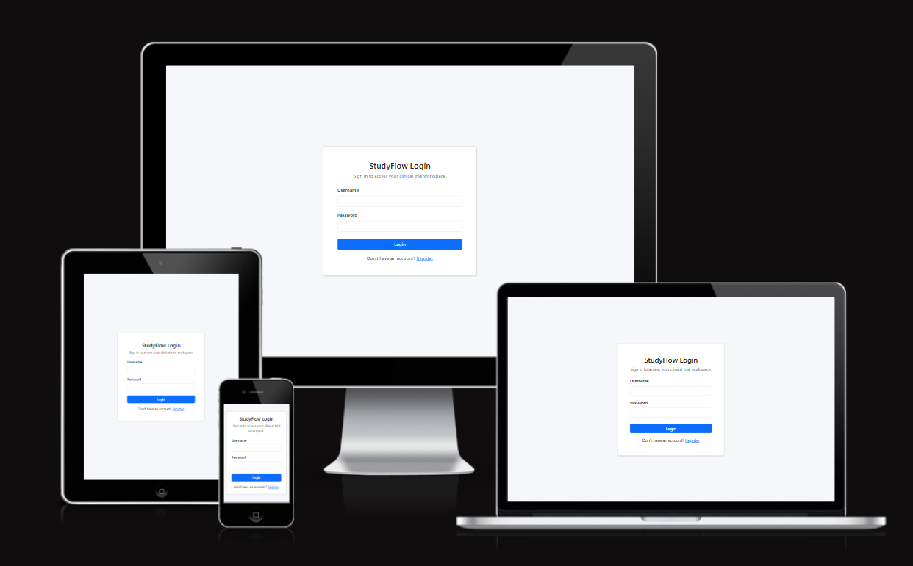


## Project Introduction and Rationale

StudyFlow is a fictional Clinical Trial Site Management System developed to provide a centralised platform for managing key activities associated with clinical research studies. The application allows authorised users to manage studies, fictional participants, scheduled visits, study documents, user assignments and notifications from a single responsive interface.

Clinical trial sites can involve multiple studies, participants, visits, documents and members of staff at the same time. Keeping this information organised and ensuring that users only have access to information relevant to their responsibilities is therefore an important part of site management. StudyFlow was designed around this problem by providing structured study management alongside role-based access control.

The application supports two main levels of access. Elevated users, such as Administrators, Investigators and Project Leads, can create studies, manage users, approve registrations and assign users to studies. Standard users, such as Study Coordinators and Trial Assistants, can access studies assigned to them and manage the fictional participants, visits and study documents associated with those studies.

I chose to develop StudyFlow because of my professional background in pharmaceutical research and clinical trials. This gave me familiarity with the workflows and organisational challenges involved in clinical research and allowed me to apply existing domain knowledge to a full-stack software development project. Rather than creating a generic CRUD application, I wanted to build a system based on a realistic professional scenario while demonstrating the technical skills developed during the Full Stack Software Development course.

StudyFlow is an educational portfolio project and is not intended for use with real clinical trial or patient data. All participant information used within the application is fictional.

The project was developed using Django and Python for the back end, PostgreSQL for relational data storage, HTML, CSS and Bootstrap for the responsive front end, Cloudinary for uploaded study documents, and WhiteNoise for static file handling. The application is deployed through Heroku.

The main goals of StudyFlow are to:

- provide a clear central location for clinical study information;
- implement secure authentication and role-based permissions;
- allow authorised users to manage fictional participants and study visits;
- allow study documents to be uploaded and associated with the appropriate study;
- provide relevant notifications about study activity;
- restrict standard users to studies to which they have been assigned;
- provide a responsive and accessible interface across desktop, tablet and mobile devices;
- demonstrate relational database design, CRUD functionality, validation, defensive programming and Django ORM usage.

## UX

### The 5 Planes of UX

The UX design for StudyFlow was planned using the Five Planes of User Experience: Strategy, Scope, Structure, Skeleton and Surface. This approach helped ensure that the application's features were based on genuine user requirements rather than designing individual pages without considering the overall workflow.

### 1. Strategy

#### Purpose

StudyFlow was designed to provide clinical trial site staff with a centralised interface for managing fictional clinical studies, participants, visits, study documents and user assignments.

The system aims to reduce the need to navigate between disconnected information by organising the main site-management activities around individual clinical studies.

The application also places particular importance on access control. Users should only be able to access information and functionality appropriate to their role and assigned studies.

#### Primary User Needs

StudyFlow has two primary groups of authenticated users.

**Elevated users - Administrators, Investigators and Project Leads**

These users need to:

- approve or reject new account registrations;
- manage registered users;
- assign appropriate roles to users;
- assign users to clinical studies;
- create new studies;
- view all studies and associated information;
- monitor activity across the application;
- access an overview of study, participant and visit activity through the dashboard.

**Standard users - Study Coordinators and Trial Assistants**

These users need to:

- access only the studies assigned to them;
- view study information without modifying the core study details;
- upload documents to assigned studies;
- create, view, update and delete fictional participants within assigned studies;
- create, view, update and delete participant visits;
- receive notifications relating to activity within their assigned studies;
- use a dashboard containing information relevant to their assigned studies.

#### Project Goals

The main project goals are to:

- provide a simple and structured clinical trial site management interface;
- demonstrate secure authentication and authorisation;
- implement role-based and study-based access control;
- provide useful CRUD functionality using Django and PostgreSQL;
- provide clear feedback following important user actions;
- maintain relationships between users, studies, participants, visits and documents;
- provide relevant notifications about study activity;
- create an interface that remains usable across desktop, tablet and mobile devices;
- follow accessibility and defensive programming principles.

### 2. Scope

The scope of StudyFlow was deliberately controlled so that the project could deliver a complete and functional MVP within the available development period.

#### Core Features

The MVP includes:

- user registration;
- administrator approval of new accounts;
- login and logout;
- role-based permissions;
- user management;
- study assignment;
- study creation;
- role-aware study lists;
- study detail pages;
- study document uploads;
- participant CRUD functionality;
- visit CRUD functionality;
- role-aware dashboards;
- database-backed notifications;
- responsive navigation and page layouts;
- server-side form validation;
- destructive-action confirmation.

#### Content Requirements

StudyFlow stores and displays information relating to:

- users and their assigned roles;
- study assignments;
- study protocol information;
- fictional participant information;
- scheduled and completed visits;
- uploaded study documents;
- user notifications.

The participant data used within StudyFlow is entirely fictional and exists only to demonstrate application functionality.

#### Features Outside the MVP

To prevent scope creep, several features were intentionally excluded from the initial version of StudyFlow.

These include:


- storage of real patient or clinical trial data.
- real-time WebSocket notifications.
- advanced analytics.
- regulatory-grade audit logging.

Some additional features were retained as Should Have or Could Have user stories and may be implemented if development time permits.

### 3. Structure

#### Information Architecture

StudyFlow follows a study-centred information structure.

The main relationship is:

**Study → Participants → Visits**

A study can contain multiple fictional participants, and each participant can have multiple visits.

Studies can also contain uploaded study documents and can have multiple users assigned to them.

Users receive notifications relevant to activity within studies to which they have been assigned.

#### Navigation

Authenticated elevated users can access:

- Dashboard
- Studies
- Participants
- Visits
- Notifications
- Users
- Logout

Authenticated standard users can access:

- Dashboard
- Studies
- Participants
- Visits
- Notifications
- Logout

The **Users** area is deliberately excluded from the standard-user navigation because user administration is restricted to authorised elevated roles.

On desktop devices, navigation is provided through a persistent left sidebar.

On tablet and mobile devices, the sidebar is replaced with a hamburger menu which opens the navigation when required. A persistent mobile bottom navigation was intentionally avoided to maintain a clean interface and prevent unnecessary duplication.

#### User Flow

A typical elevated-user flow is:

1. Log in to StudyFlow.
2. Review the global dashboard.
3. Review pending registrations.
4. Approve a user and assign an appropriate role.
5. Create or view a study.
6. Assign users to the study.
7. Monitor study, participant, visit and document activity.

A typical standard-user flow is:

1. Register for a StudyFlow account.
2. Wait for account approval and role assignment.
3. Log in after approval.
4. View the assigned-study dashboard.
5. Open an assigned study.
6. Manage fictional participants within that study.
7. Schedule and update participant visits.
8. Upload relevant study documents.
9. Review notifications relating to assigned-study activity.

### 4. Skeleton

The StudyFlow interface was designed around a consistent application shell so that users do not need to relearn the interface when moving between different areas.

The main page structures include:

- authentication forms for registration and login.
- dashboard statistic cards and activity tables.
- study list and study detail pages.
- participant and visit tables.
- create and update forms.
- confirmation pages for destructive actions.
- user-management screens.
- notification lists.
- responsive desktop, tablet and mobile navigation.

Tables are used where users need to compare structured information, while cards and forms are used where information needs greater visual separation.

Initial wireframes were produced for desktop, tablet and mobile layouts before the main interface was implemented. These are documented in the [Wireframes](#wireframes) section.

### 5. Surface

**Visual Design Elements**

- [**Colour Scheme**](#colour-scheme) (see below)
- [**Typography**](#typography) (see below)

The visual design of StudyFlow was created to provide a clean, professional and structured interface appropriate for a clinical trial site management application. The design deliberately avoids excessive decoration so that studies, participants, visits, documents and notifications remain the main focus of each page.

### Colour Scheme

StudyFlow uses a restrained blue, white and neutral-grey colour palette. Dark navy is used for the primary navigation to provide a strong visual structure, while lighter backgrounds are used throughout the main content area to keep data-heavy pages clear and readable.

Blue is used for primary actions and interactive emphasis, while red is reserved for destructive actions and validation feedback. Status information also includes visible text so that meaning is not communicated through colour alone.

The main colours used throughout StudyFlow are:

- `#17324D` — primary dark navy used for the desktop sidebar and mobile navigation header. This provides strong separation between the main navigation and application content.
- `#F5F7FA` — light grey page background used behind the main application content to reduce the visual harshness of a completely white interface.
- `#FFFFFF` — white used for cards, forms, tables and other primary content surfaces.
- `#0D6EFD` — Bootstrap primary blue used for primary actions, links, focus indicators and interface emphasis.
- `#198754` — Bootstrap success green used for positive and completed states where appropriate.
- `#DC3545` — Bootstrap danger red used for destructive actions such as deletion.
- `#B02A37` — dark red used for form validation error messages to clearly distinguish invalid input.
- `#6C757D` — muted grey used for secondary information and form help text.
- `#E1E6EB` — light border colour used around cards, tables and notification containers.
- `#EEF2F6` — light interaction background used when navigation items are hovered or focused.

The palette was selected to maintain a professional clinical appearance while providing clear visual distinction between navigation, content, actions, status information and warnings.

Colour is not relied upon as the only method of communicating important information. For example, notification states and application statuses also contain descriptive text.


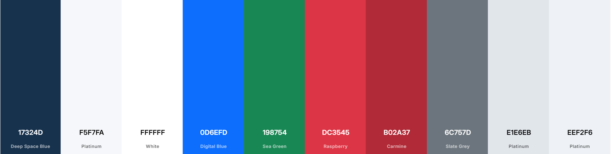

### Typography

StudyFlow uses the default Bootstrap system font stack rather than importing external Google Fonts.

Using a system font stack allows the application to use fonts already available on the user's operating system. This provides a familiar appearance, reduces the need for additional font downloads and helps maintain consistent readability across different devices and browsers.

Typography follows a clear hierarchy:

- headings are used to identify pages and major content sections;
- bold and semi-bold text is used for navigation, form labels and important information;
- standard body text is used for descriptions and application content;
- smaller muted text is used for secondary information and form guidance;
- larger bold values are used on dashboard statistic cards to make important figures easy to identify.

Bootstrap's responsive typography and spacing are combined with custom CSS to maintain consistency across desktop, tablet and mobile layouts.

No external icon library is currently required for the core StudyFlow interface. Bootstrap's built-in components and standard text labels are used for navigation and actions.

## Wireframes

Wireframes were created during the planning stage of StudyFlow to establish the application's information hierarchy, navigation and responsive layout before detailed visual styling was applied.

The wireframes were intentionally kept low-fidelity. They use simple boxes, placeholder content and minimal visual styling because their purpose was to plan the position and relationship of interface elements rather than represent the final appearance of the application.

Separate layouts were considered for elevated users and standard users because the information and functionality available to each role differs.

Elevated users such as Administrators, Investigators and Project Leads require access to user management and application-wide information, while Study Coordinators and Trial Assistants require an interface focused on their assigned studies.

Responsive layouts were also considered from the beginning. Desktop designs use a persistent sidebar, while tablet and mobile designs replace this with a hamburger navigation menu to preserve screen space.

### Dashboard Wireframes

The dashboard wireframes demonstrate how the interface adapts according to both user role and screen size.

| Desktop | Tablet | Mobile |
| --- | --- | --- |
| Elevated user dashboard | Elevated user dashboard | Elevated user dashboard |
| Standard user dashboard | Standard user dashboard | Standard user dashboard |

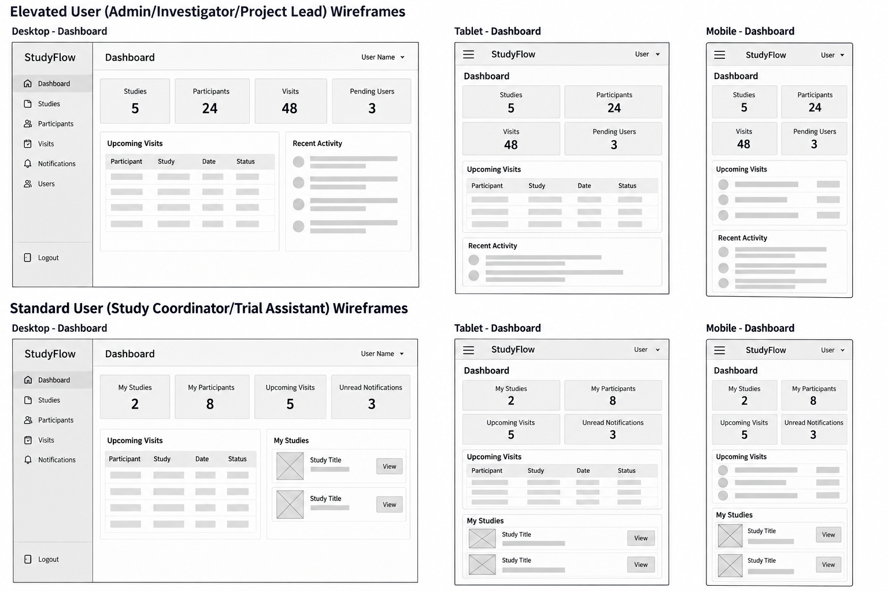

### Application Wireframes

Additional wireframes were created for the main workflows within StudyFlow, including:

- login and registration.
- user management.
- studies list.
- study details.
- participant management.
- visit forms.
- study documents.
- notifications.
- confirmation screens.

These wireframes were used as a structural guide during development. Some elements evolved during implementation as usability, permissions and technical requirements became clearer.

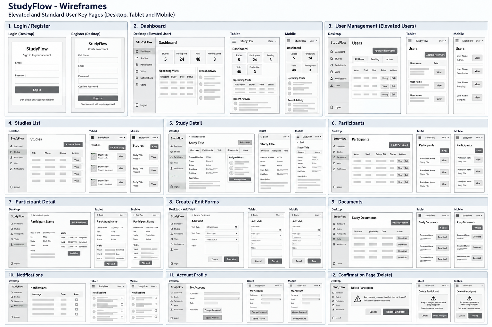

### Changes From the Initial Wireframes

The wireframes were treated as a guide rather than a fixed specification. During development, several interface decisions were refined after testing the application in the browser.

Examples include:

- responsive navigation was implemented using a persistent sidebar on desktop and a hamburger/offcanvas menu on tablet and mobile.
- user study assignments were moved into a dedicated user detail workflow rather than overloading the main users list.
- destructive actions were given dedicated confirmation pages to reduce accidental deletion.
- study core information remained read-only after creation, while authorised users can manage associated participants, visits and documents.
- dashboard information became role-aware so standard users only see information associated with their assigned studies.
- notification previews were incorporated into the dashboard while the full notification history remains available from the Notifications page.

These changes demonstrate the iterative development process between the original UX planning and the final implementation.

## User Stories

User stories were used throughout the development of StudyFlow to define functionality from the perspective of the application's users.

The stories were managed using GitHub Issues and the StudyFlow GitHub Project board. Each story was prioritised using the MoSCoW method and moved through the development workflow:

**Todo → In Progress → Testing → Done → Future Additions**

Detailed acceptance criteria are maintained within the corresponding GitHub Issues, while the tables below provide an overview of the requirements used to guide development.

### Must Have User Stories

The following user stories formed the core MVP requirements for StudyFlow.

| ID | User Story |
| --- | --- |
| US01 | As a new user, I want to register for an account so that I can request access to StudyFlow. |
| US02 | As an authorised elevated user, I want to approve or reject registrations so that only authorised users can access the system. |
| US03 | As an approved user, I want to log in securely so that I can access functionality appropriate to my role. |
| US04 | As an authenticated user, I want to log out securely so that my account is protected when I finish using the application. |
| US05 | As a user, I want the interface to reflect my authentication state so that I can clearly understand whether I am logged in and which functionality is available to me. |
| US06 | As an authorised elevated user, I want to search for and view registered users so that I can manage application access efficiently. |
| US07 | As an authorised elevated user, I want to assign users to studies so that staff can access the studies they are responsible for. |
| US08 | As an authorised elevated user, I want to delete a user when necessary so that obsolete accounts can be removed securely. |
| US09 | As an authorised elevated user, I want to create a study so that new clinical trial studies can be managed within StudyFlow. |
| US10 | As an elevated user, I want to view all studies so that I can oversee study activity across the application. |
| US11 | As a standard user, I want to view only studies assigned to me so that I only access information relevant to my responsibilities. |
| US12 | As an authorised study user, I want to upload study documents so that relevant documentation can be stored against the appropriate study. |
| US13 | As an authorised study user, I want to add a fictional participant to a study so that participant activity can be managed. |
| US14 | As an authorised user, I want to view fictional participants associated with accessible studies so that I can review participant information. |
| US15 | As an authorised study user, I want to update a fictional participant so that their study information can be kept current. |
| US16 | As an authorised study user, I want to delete a fictional participant so that incorrectly created or unnecessary records can be removed. |
| US17 | As an authorised study user, I want to add a visit for a participant so that study visits can be scheduled and tracked. |
| US18 | As an authorised user, I want to view visits associated with accessible studies so that I can monitor visit activity. |
| US19 | As an authorised study user, I want to update a visit so that its status, dates and notes can be maintained. |
| US20 | As an authorised study user, I want to delete a visit so that incorrect or unnecessary visit records can be removed. |
| US21 | As an elevated user, I want a global dashboard so that I can see an overview of activity across the application. |
| US22 | As a standard user, I want a personalised dashboard so that I only see information associated with my assigned studies. |
| US23 | As a user, I want to receive relevant notifications so that I am aware of important activity relating to my studies. |
| US24 | As a user, I want to view and mark notifications as read so that I can manage information that requires my attention. |
| US25 | As a user, I want the application to work across desktop, tablet and mobile devices so that I can use StudyFlow on different screen sizes. |
| US26 | As a user, I want an accessible interface so that StudyFlow is understandable and operable for users with different accessibility requirements. |

### Should Have User Stories

These stories provide useful improvements to the core application but are not required for the initial MVP to function.

| ID | User Story |
| --- | --- |
| US27 | As a user, I want to filter studies by status so that I can find relevant studies more efficiently. |
| US28 | As a user, I want to search participants so that I can locate a fictional participant without manually reviewing the entire list. |
| US29 | As a user, I want to filter visits so that I can more easily review relevant visit activity. |

### Could Have User Stories

These stories were identified as potential enhancements if sufficient development time remained after completion and testing of the core application.

| ID | User Story |
| --- | --- |
| US30 | As an authorised user, I want enhanced dashboard charts so that application activity can be visualised more easily. |
| US31 | As an elevated user, I want an activity audit log so that important actions within StudyFlow can be reviewed. |
| US32 | As a study user, I want a visit progress indicator so that I can quickly understand a participant's progress through their study visits. |

### MoSCoW Prioritisation

The MoSCoW method was used to control the project scope within the available development period.

**Must Have** stories represent the core StudyFlow MVP. These include authentication, permissions, studies, participants, visits, dashboards, notifications, responsiveness and accessibility.

**Should Have** stories improve usability but do not prevent the core application from operating if they are not completed.

**Could Have** stories represent enhancements that were deliberately kept outside the core MVP until the essential functionality had been implemented and tested.

This prioritisation helped prevent scope creep and ensured that development remained focused on delivering a secure and functional application before optional enhancements were considered.

## Features

### Existing Features

StudyFlow contains a range of features designed around the management of fictional clinical trial studies. Functionality is controlled through authentication, role permissions and study assignments so that users only have access to appropriate areas of the application.

The screenshots below demonstrate the main features of the final deployed application.

### Registration

New users can create a StudyFlow account using the registration form. Django's authentication system handles password security and password validation.

Newly registered accounts do not receive immediate access to the application. Their account must first be approved and assigned an appropriate role by an authorised elevated user.

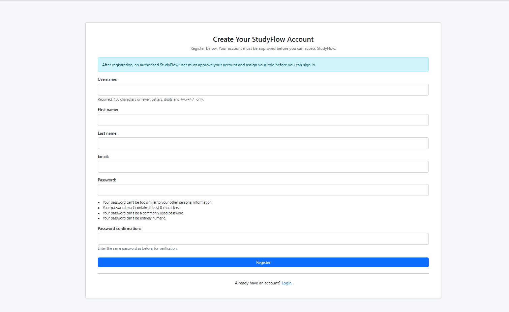

### Login and Logout

Approved users can securely log in using their StudyFlow credentials.

The login process checks that the account has been approved and has an assigned role before allowing access to the application.

Authenticated users can securely log out using the Logout control available within the navigation.

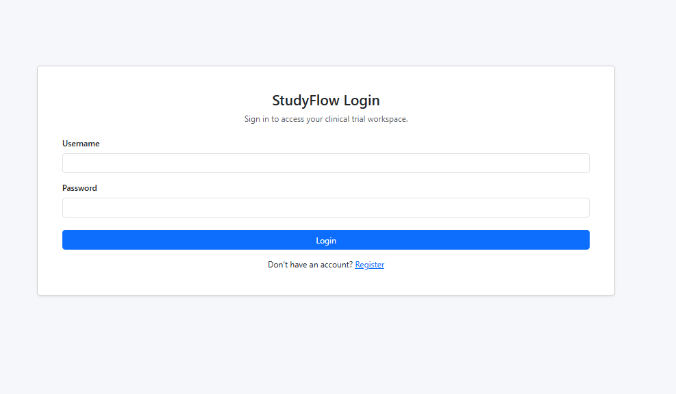

### Role-Based Access Control

StudyFlow provides different levels of functionality depending on the user's assigned role.

Elevated roles include:

- Administrator
- Investigator
- Project Lead

Standard roles include:

- Study Coordinator
- Trial Assistant

Elevated users can access application-wide information and authorised management functionality.

Standard users are restricted to studies to which they have been actively assigned. This restriction is enforced by the Django back end rather than relying only on hiding navigation links.

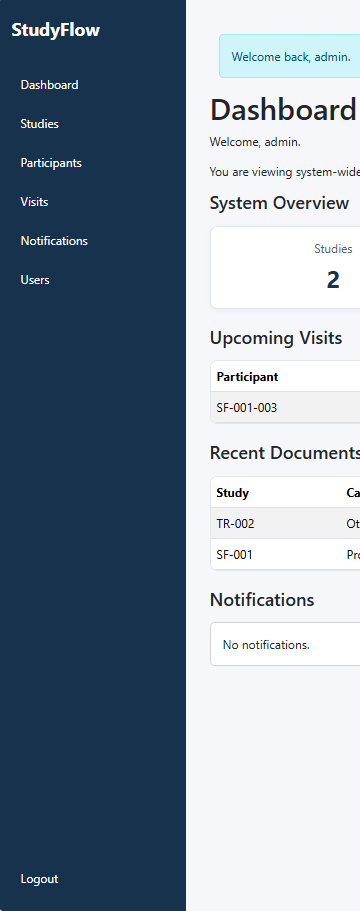
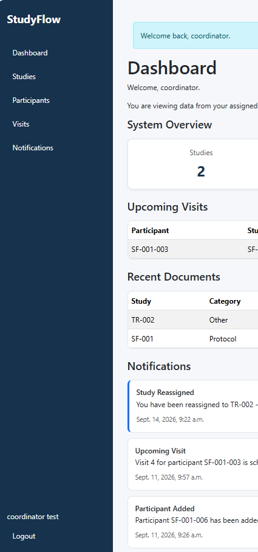

### Elevated User Dashboard

Administrators, Investigators and Project Leads receive a global dashboard containing an overview of application activity.

The dashboard provides summary information and quick access to recent study activity, allowing elevated users to monitor information across accessible studies.

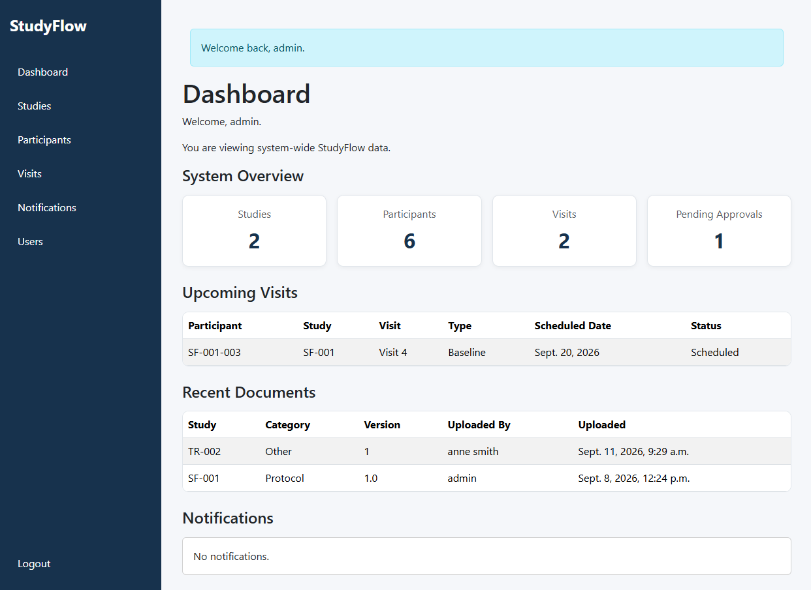

### Standard User Dashboard

Study Coordinators and Trial Assistants receive a role-aware dashboard.

Instead of displaying application-wide information, the dashboard is filtered using Django ORM queries so that standard users only receive information associated with their active study assignments.

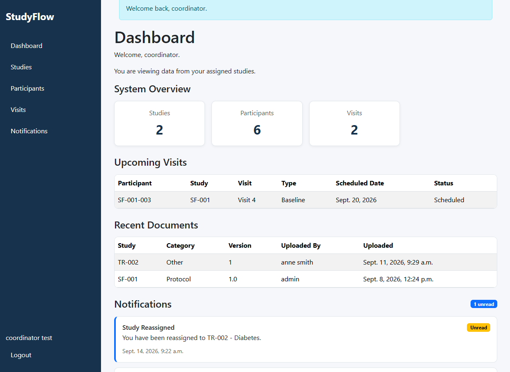

### User Management

Authorised elevated users have access to a dedicated Users area.

The user-management workflow allows authorised users to:

- search registered users
- review pending registrations
- approve or reject accounts
- view individual user details
- assign appropriate roles
- assign users to studies
- remove study assignments
- delete user accounts

Elevated role assignment is additionally restricted so that only a Django superuser can assign elevated roles.

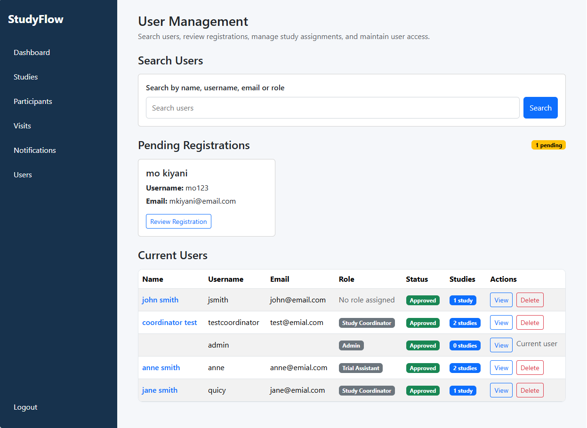

### User Study Assignment

Study access for standard users is controlled through explicit study assignments.

An authorised elevated user can open a user's details and assign that user to one or more studies. Assignments can later be made inactive without deleting their historical database record.

This relationship allows StudyFlow to determine which studies, participants, visits and dashboard information a standard user is permitted to access.

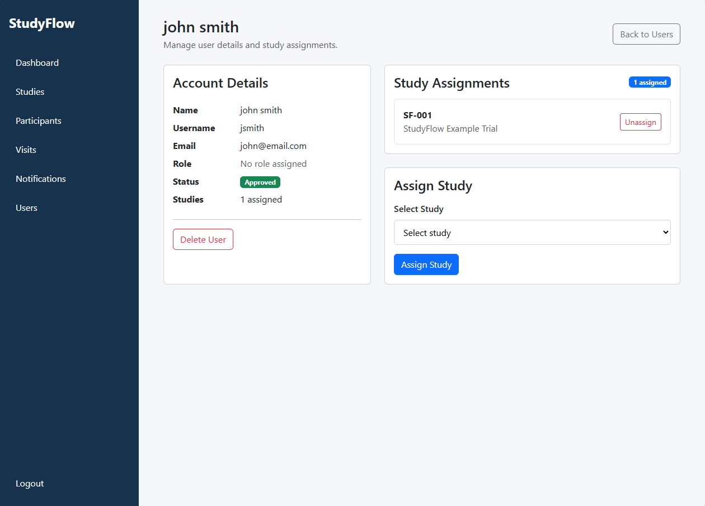

### Study Management

Authorised elevated users can create clinical studies using a validated Django form.

Study information includes:

- protocol number
- title
- description
- phase
- status
- start date
- end date

The protocol number must be unique, and date validation prevents an end date from being entered before the study start date.

Core study information is treated as read-only after creation within the current MVP.

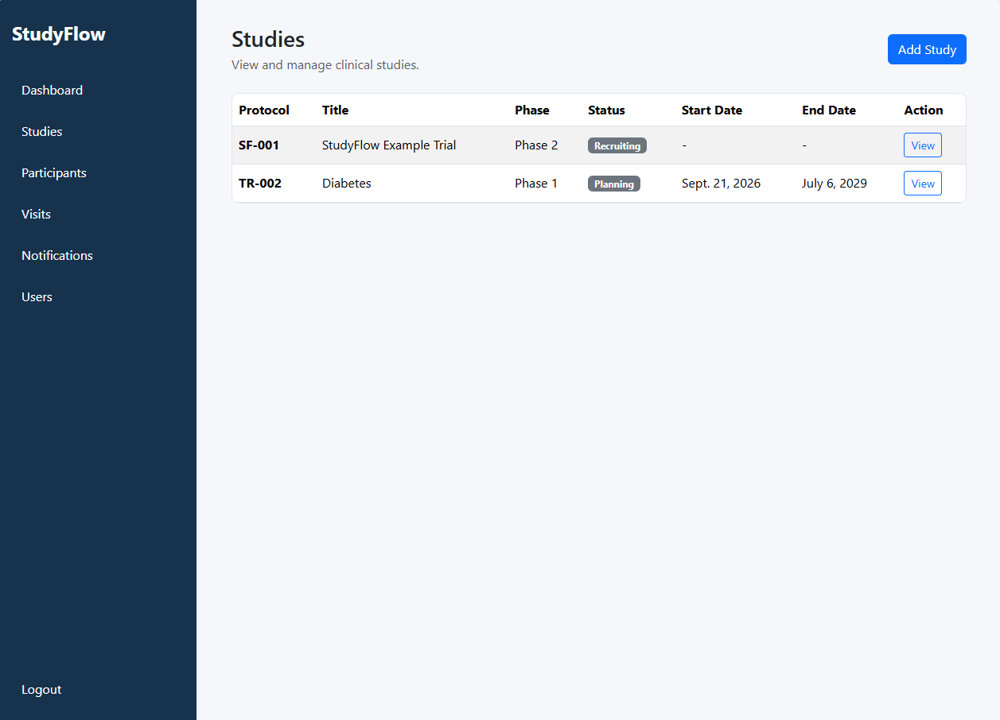

### Study Detail

Each accessible study has a dedicated detail page bringing related information together.

The page provides access to study information, fictional participants and uploaded study documents.

Standard users can only access a study detail page when they have an active assignment to that study, while authorised elevated users can access studies according to their role permissions.

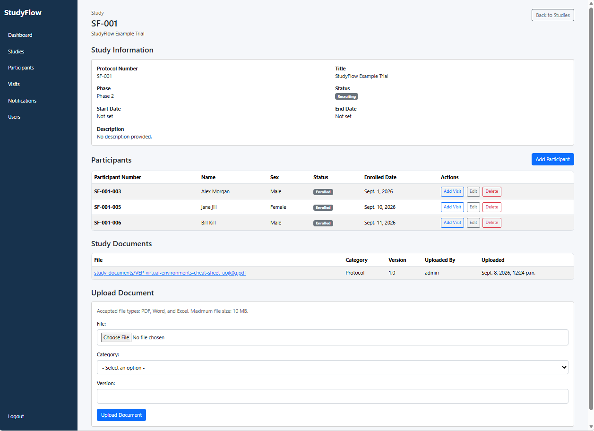

### Study Document Uploads

Authorised users can upload documents against an accessible study.

Study documents contain a category and version and are associated with both the relevant study and the user who uploaded the document.

The upload form validates file extensions and limits uploads to a maximum size of 10 MB. Supported document types include PDF, Word and Excel documents.

Uploaded study documents are stored using Cloudinary.


### Participant Management

Authorised study users can create, view, update and delete fictional participant records within studies they are permitted to access.

Participant information includes:

- participant number
- first name
- last name
- date of birth
- sex
- participant status
- enrolment date

Participant numbers must be unique and are normalised to uppercase. Form validation also prevents an enrolment date from being entered before the participant's date of birth.

All participant information used within StudyFlow is fictional and must not be interpreted as real clinical or patient data.

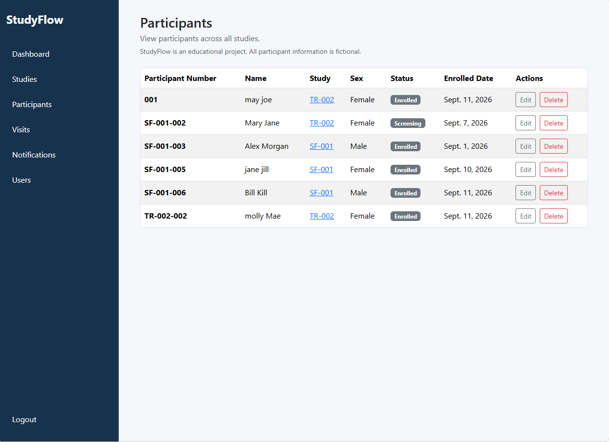

### Visit Management

Visits can be created and managed for fictional participants within accessible studies.

Visit information includes:

- visit number
- visit type
- scheduled date
- actual date
- status
- notes

A participant cannot have duplicate visit numbers. Additional validation checks the relationship between scheduled and actual dates and requires an actual visit date when a visit is marked as completed.

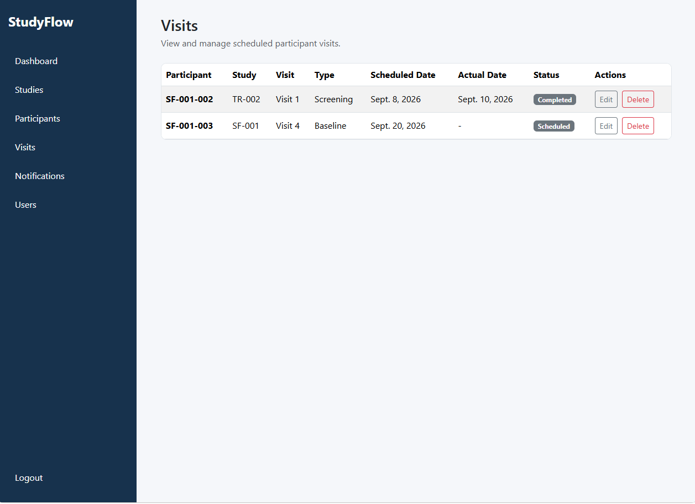

### Destructive Action Confirmation

Destructive actions use dedicated confirmation pages rather than immediately deleting database records.

For sensitive deletion actions, such as deleting a user or fictional participant, the user is shown a warning and must provide additional confirmation before the operation is completed.

This reduces the likelihood of accidental data deletion and demonstrates defensive design within the application.

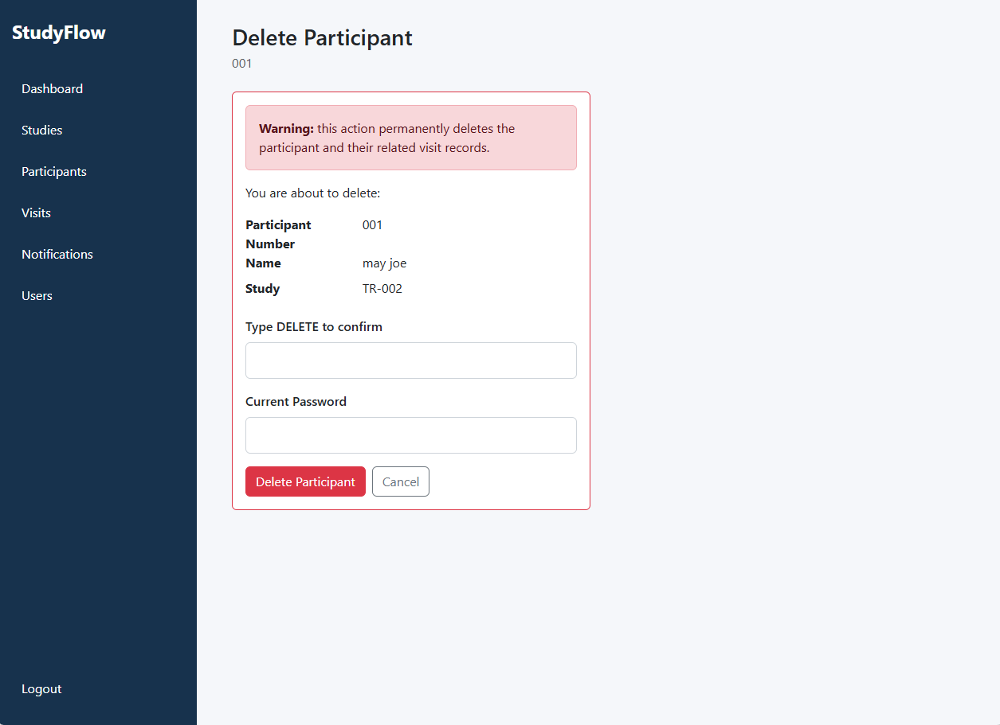
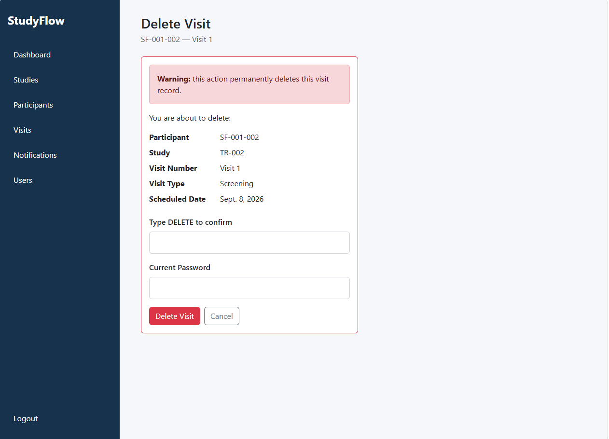

### Notifications

StudyFlow contains a database-backed notification system.

Notifications are created for relevant application events such as:

- a user being assigned to a study
- a fictional participant being added
- a study document being uploaded
- a visit being completed
- an upcoming visit being created

Study-related notifications are sent to active, approved users assigned to the relevant study. The user responsible for performing the study activity can be excluded where appropriate to avoid unnecessary self-notifications.

Users can view their own notifications and manage their read status.

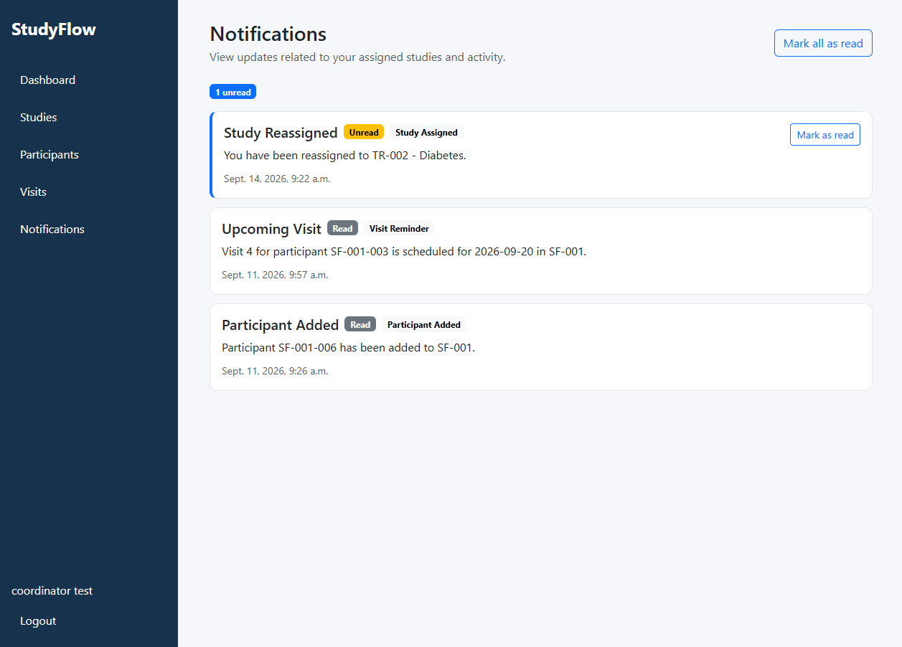

### Responsive Navigation

StudyFlow was designed to work across desktop, tablet and mobile screen sizes.

Desktop users receive a persistent left-hand navigation sidebar.

On smaller screens, the sidebar is removed and replaced by a hamburger button which opens an offcanvas navigation menu. This provides access to the same appropriate functionality without permanently occupying limited mobile screen space.

The navigation is also role-aware, meaning the Users area is only displayed to users authorised to manage users.

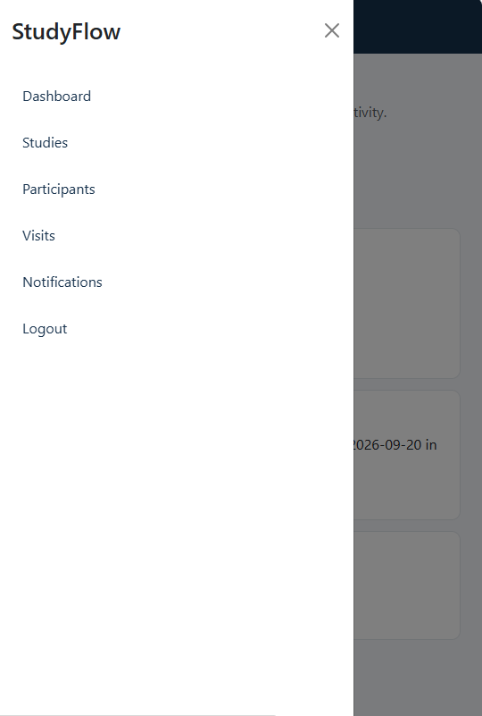

### Accessible Interface

Accessibility was considered throughout the interface design.

StudyFlow uses semantic HTML, labelled form controls, structured heading levels, table headings, visible validation messages, descriptive status text and visible keyboard focus indicators.

Accessibility is verified separately through manual and automated testing, with the results documented in [TESTING.md](TESTING.md).

### Future Features

The following enhancements were identified during project planning but were kept outside the core MVP so that development could remain focused on delivering and testing the essential StudyFlow functionality.

#### Study Status Filtering

Users could filter the study list by statuses such as Planning, Recruiting, Active, Completed, Suspended or Terminated.

This corresponds to **US27**.

#### Participant Search

A participant search feature could allow authorised users to locate fictional participants more quickly using participant numbers or other appropriate searchable information.

Search results would continue to respect existing study-access permissions.

This corresponds to **US28**.

#### Visit Filtering

Visit filtering could allow users to narrow the visit list by criteria such as visit status, study or scheduled date.

This corresponds to **US29**.

#### Enhanced Dashboard Visualisations

Charts could be introduced to provide additional visual summaries of study, participant and visit activity.

Any visualisations would remain role-aware so that standard users could not use dashboard charts to infer information about studies to which they are not assigned.

This corresponds to **US30**.

#### Activity Audit Log

A future version of StudyFlow could provide an activity history showing important actions such as user approvals, assignments and record changes.

The current project does not claim to provide a regulatory-grade clinical audit trail.

This corresponds to **US31**.

#### Visit Progress Indicator

Participant pages could display a visual progress indicator showing progression through scheduled study visits.

This could make it easier for study staff to identify completed, upcoming and outstanding visits.

This corresponds to **US32**.

#### Additional Future Development

Beyond the current user stories, a production-focused version of StudyFlow could potentially include more advanced document management, reporting and administrative functionality.

However, integration with real clinical systems, storage of real patient data and regulatory compliance would require substantially greater security, privacy, validation and governance requirements than are within the scope of this educational project.

## Tools & Technologies

The following technologies and development tools were used to design, build, test and deploy StudyFlow.

| Technology | Purpose |
| --- | --- |
| HTML5 | Provides the semantic structure for the StudyFlow user interface. |
| CSS3 | Provides custom styling, responsive adjustments, form styling and visual presentation. |
| Bootstrap 5 | Provides responsive layout utilities and interface components, including the mobile offcanvas navigation. |
| Python | Primary back-end programming language used for application logic, validation and database interaction. |
| Django | Main web framework used for authentication, forms, models, views, URL routing, permissions and ORM functionality. |
| PostgreSQL | Relational database used to store StudyFlow application data. |
| Django ORM | Provides object-oriented interaction between Django models and the PostgreSQL database. |
| Cloudinary | Provides cloud storage for uploaded study documents. |
| WhiteNoise | Serves application static files in the deployed environment. |
| Gunicorn | Production WSGI server used to run the Django application on Heroku. |
| Heroku | Cloud platform used to deploy and host the live StudyFlow application. |
| Git | Provides version control throughout development. |
| GitHub | Hosts the source-code repository and provides Issues and project-management functionality. |
| GitHub Projects | Used to manage the Agile workflow and track user stories from Backlog through development and testing. |
| Visual Studio Code | Primary development environment used to build StudyFlow. |
| ChatGPT | Used as an AI-assisted development tool for debugging, explaining code and supporting documentation. |

### Development and Testing Tools

Several additional tools are used during development and testing:

- **Chrome Developer Tools** - used for responsive testing, browser inspection and accessibility testing.
- **Lighthouse** - used to assess accessibility, performance, best practices and SEO on the deployed application.
- **W3C HTML Validator** - used to validate rendered HTML.
- **W3C CSS Validation Service** - used to validate custom CSS.
- **CI Python Linter** - used to check Python code against PEP8 conventions.
- **Django Test Framework** - used for automated application and permission testing.
- **Django System Check Framework** - used throughout development with `python manage.py check` to identify configuration and application issues.

## AI Tool Usage 

Chat GPT was used as supporting development assistant during the project. It was primarily used to speed up project structuring, troubleshooting, review potential code improvements, and refine spelling/grammar and documentation.

All planning, design decisions, implementation, testing, and final code changes were completed and validated by the project author. AI suggestions were reviewed critically and applied only where they aligned with project requirements and best practices.

## Database Design

### Data Model

StudyFlow uses a relational PostgreSQL database managed through Django's Object Relational Mapper (ORM).

The database was designed around the relationship between clinical studies, authorised users, fictional participants and participant visits.

At the centre of the application is the `Study` model. Users can be assigned to studies through the `UserStudy` model, studies contain fictional participants, participants contain visits, and documents can be uploaded against individual studies.

Django's built-in `User` model is used for authentication rather than creating a custom password-management system. Additional StudyFlow-specific user information, such as role and approval status, is stored separately in the `UserProfile` model.

The main model relationships are:

**User → UserProfile → Role**

**User → UserStudy ← Study**

**Study → Participant → Visit**

**Study → StudyDocument**

**User → Notification**

### Database Models

#### User

StudyFlow uses Django's built-in `User` model for authentication.

This provides Django's established functionality for:

- usernames
- first and last names
- email addresses
- password hashing
- authentication
- active-user status
- superuser status

Application-specific information is deliberately separated into the `UserProfile` model rather than attempting to store or manage passwords manually.

#### Role

The `Role` model defines the application-level role assigned to a user.

Important fields include:

- `name`
- `description`
- `is_admin`
- `can_approve_users`
- `can_manage_studies`
- `can_manage_users`

The permission fields allow StudyFlow to make authorisation decisions through database-backed role information rather than relying only on role names within templates.

The current roles are:

- Administrator
- Investigator
- Project Lead
- Study Coordinator
- Trial Assistant

#### UserProfile

Each Django user has one `UserProfile`.

The profile stores:

- the associated Django user
- the user's StudyFlow role
- account approval status

This allows the application to check whether a newly registered user has been approved before granting access.

A Django signal automatically creates a `UserProfile` when a new user is created.

#### UserStudy

`UserStudy` represents the assignment of a user to a study.

Important fields include:

- `user`
- `study`
- `assigned_by`
- `assigned_at`
- `is_active`

An explicit assignment model was chosen instead of a basic many-to-many field because StudyFlow needs additional information about the relationship itself.

For example, the application needs to know who made an assignment, when it was created and whether the assignment is currently active.

A database constraint prevents the same user and study combination from being created more than once.

Study assignments are also important to application security. Standard users are filtered against active `UserStudy` records before being allowed to access study-related information.

#### Study

The `Study` model stores the main information for each fictional clinical study.

Important fields include:

- `protocol_number`
- `title`
- `description`
- `phase`
- `status`
- `start_date`
- `end_date`
- `created_at`
- `updated_at`

The protocol number is unique to prevent duplicate study identifiers.

Study phase and status use predefined Django `TextChoices` to keep database values consistent.

#### StudyDocument

`StudyDocument` represents a document uploaded against a study.

Important fields include:

- `study`
- `uploaded_by`
- `file`
- `category`
- `version`
- `uploaded_at`

Each document belongs to a study and records the user responsible for uploading it.

The file itself is managed through a Django `FileField` using Cloudinary-backed storage.

Document categories use predefined choices to provide consistent classification.

#### Participant

The `Participant` model stores fictional participant information associated with a study.

Important fields include:

- `study`
- `participant_number`
- `first_name`
- `last_name`
- `date_of_birth`
- `sex`
- `status`
- `enrolled_date`
- `created_at`
- `updated_at`

Each participant belongs to one study, while a study can contain multiple participants.

Participant numbers are unique to prevent duplicate participant identifiers within the current application design.

All participant information contained within StudyFlow is fictional and is used only to demonstrate application functionality.

#### Visit

The `Visit` model represents a study visit belonging to a fictional participant.

Important fields include:

- `participant`
- `visit_number`
- `visit_type`
- `scheduled_date`
- `actual_date`
- `status`
- `notes`
- `created_at`
- `updated_at`

A participant can have multiple visits.

A database-level unique constraint prevents the same visit number from being assigned more than once to the same participant.

The model therefore allows Visit 1 to exist for many different participants while preventing a single participant from accidentally having two Visit 1 records.

#### Notification

The `Notification` model stores notifications for individual users.

Important fields include:

- `user`
- `title`
- `message`
- `type`
- `is_read`
- `created_at`

Each notification belongs to one user.

Notifications are database-backed rather than real-time WebSocket notifications. This was considered sufficient for the StudyFlow MVP while still demonstrating relational data, application events and personalised user information.

### Entity Relationship Diagram

The following Entity Relationship Diagram illustrates the primary database models and relationships used within StudyFlow.

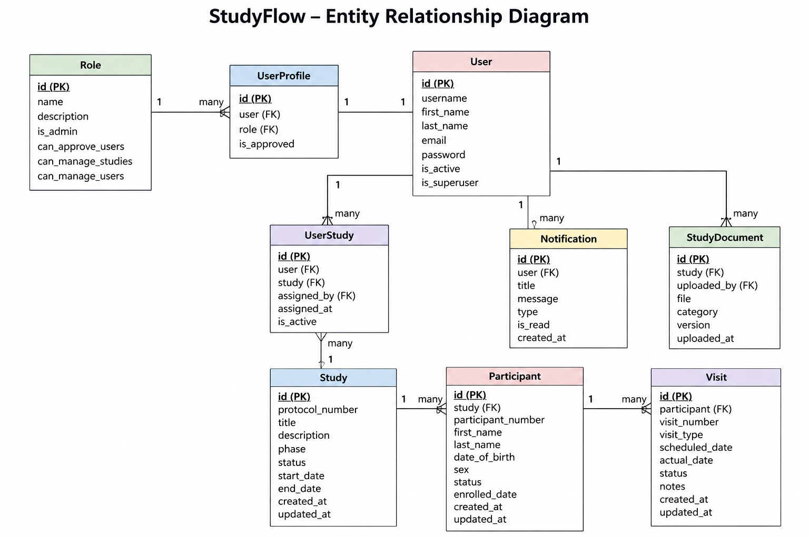

The primary relationships are:

- one `User` has one `UserProfile`;
- one `Role` can be assigned to multiple user profiles;
- one `User` can have multiple `UserStudy` assignments;
- one `Study` can have multiple `UserStudy` assignments;
- one `Study` can contain multiple `Participant` records;
- one `Participant` can contain multiple `Visit` records;
- one `Study` can contain multiple `StudyDocument` records;
- one `User` can upload multiple `StudyDocument` records;
- one `User` can receive multiple `Notification` records.

The `UserStudy` model acts as the relationship between users and studies and allows StudyFlow to store assignment-specific information while also supporting study-level access control.

## Agile Development Process

StudyFlow was developed using an Agile approach supported by GitHub Issues and a GitHub Project board.

The project was broken down into user stories so that each feature could be planned, developed, tested and reviewed independently. This helped keep the project manageable during the limited development period and made it easier to track progress against the assessment requirements.

### GitHub Project Board

A GitHub Project named **StudyFlow Development** was used to manage the workflow.

The board uses the following columns:

**Todo → In Progress → Testing → Done → Future Additions**

Each user story begins in the Todo.

When a story is selected for development, it is moved to Todo and then into In Progress while the functionality is being implemented.

Once the implementation is complete, the story moves into Testing so that the acceptance criteria, browser behaviour and permissions can be checked.

Only after the feature has been successfully tested is the story moved to Done.


### GitHub Issues

Individual user stories were created as GitHub Issues.

Each issue represents a specific piece of functionality and includes acceptance criteria so that there is a clear definition of when the feature can be considered complete.

This provides traceability between:

- project planning
- implementation
- testing
- Git commits
- final application features


### MoSCoW Prioritisation

The MoSCoW method was used to prioritise the StudyFlow user stories.

#### Must Have

Must Have stories contain the functionality required for the StudyFlow MVP to operate successfully.

These include:

- registration and authentication
- account approval
- role-based permissions
- user management
- study management
- study assignments
- participant CRUD functionality
- visit CRUD functionality
- study documents
- dashboards
- notifications
- responsive design
- accessibility

These stories were prioritised before optional functionality.

#### Should Have

Should Have stories provide useful improvements but are not required for the core application to function.

These include:

- study filtering
- participant searching
- visit filtering

These were intentionally placed behind the core MVP requirements.

#### Could Have

Could Have stories represent enhancements that could be implemented if sufficient development time remained.

These include:

- enhanced dashboard charts
- an activity audit log
- a visit progress indicator

By separating these features from the core MVP, the project could remain focused on delivering a secure and complete application rather than expanding the scope before the essential functionality had been tested.

### Agile Iteration

Development was iterative rather than following the initial wireframes and feature ideas without change.

Several features evolved during implementation and testing.

Examples include:

- moving study assignment management into an individual user detail page
- using inactive study assignments rather than deleting assignment records
- creating stronger confirmation workflows for destructive actions
- restricting elevated role assignment to Django superusers
- filtering dashboard information according to active study assignments
- refining responsive navigation for smaller screen sizes
- improving accessibility after reviewing semantic structure and keyboard interaction

These changes were made because testing and implementation revealed more appropriate solutions than the initial design.

This iterative process allowed StudyFlow to develop while still remaining aligned with the original project goals and user requirements.

## Testing

StudyFlow has been tested throughout development using a combination of manual testing, automated Django tests, code validation, responsive testing and defensive programming tests.

Testing focuses particularly on authentication, role-based permissions, study-level access control, CRUD functionality, form validation and ensuring that users cannot access or modify information outside their authorised studies.

Testing includes:

- HTML validation using the W3C Markup Validation Service
- CSS validation using the W3C CSS Validation Service
- Python validation against PEP8 conventions
- Django automated unit testing
- manual user acceptance testing
- authentication and permission testing
- defensive programming and restricted URL testing
- form and server-side validation testing
- responsive testing across desktop, tablet and mobile screen sizes
- browser compatibility testing
- keyboard accessibility testing
- Lighthouse auditing
- user story testing
- deployment and production testing
- bug tracking and regression testing

Detailed testing procedures, results, screenshots, automated test evidence and documented bugs can be found in the separate testing document:

### [View StudyFlow Testing Documentation](TESTING.md)

## Deployment

StudyFlow is deployed using Heroku with a PostgreSQL database. Cloudinary is used for uploaded study documents, while WhiteNoise is used to serve the application's static files.

The live application can be accessed here:

[StudyFlow Live Site](https://studyflow-83c0183db652.herokuapp.com)

### Heroku Deployment

The following process was used to deploy StudyFlow to Heroku:

1. Create a new application on Heroku.
2. Connect the Heroku application to the StudyFlow GitHub repository.
3. Configure the required environment variables using Heroku Config Vars.
4. Ensure all project dependencies are included in `requirements.txt`.
5. Configure Gunicorn as the production WSGI server.
6. Configure WhiteNoise for static file handling.
7. Configure Cloudinary for uploaded study documents.
8. Configure the PostgreSQL database through the `DATABASE_URL` environment variable.
9. Add the required `Procfile` to the root of the project.
10. Deploy the `main` branch through Heroku.
11. Apply database migrations during deployment.
12. Verify the deployed application and static assets.

### Environment Variables

Sensitive configuration values are stored in environment variables and are never committed to the GitHub repository.

The production environment requires the following values:

| Variable | Purpose |
| --- | --- |
| `SECRET_KEY` | Django secret key used for cryptographic signing and security functionality. |
| `DATABASE_URL` | Connection URL for the PostgreSQL database. |
| `CLOUDINARY_URL` | Cloudinary credentials used for uploaded study-document storage. |

Production runs with Django debug mode disabled.

Actual credentials and database connection details are not included in this documentation for security reasons.

### Procfile

Heroku uses the root-level `Procfile` to determine how the StudyFlow application should run.

The StudyFlow `Procfile` contains:

```text
release: python manage.py migrate --noinput
web: gunicorn studyflow.wsgi
```

The `release` command applies outstanding Django migrations during deployment.

The `web` command starts the application using Gunicorn and the StudyFlow WSGI configuration.

### PostgreSQL

StudyFlow uses PostgreSQL as its relational database.

The database connection is supplied through the `DATABASE_URL` environment variable and parsed within Django using `dj-database-url`.

Database schema changes are managed using Django migrations.

Typical migration commands used during development include:

```bash
python manage.py makemigrations
python manage.py migrate
```

Database credentials are never stored directly within the public source code.

### Cloudinary

Cloudinary is used to store files uploaded through the StudyFlow study-document functionality.

The application uses a Django `FileField` with Cloudinary-backed storage.

The Cloudinary connection is provided through the `CLOUDINARY_URL` environment variable.

Cloudinary is used for uploaded media/documents and is not responsible for serving the application's CSS or other static assets.

### Static Files and WhiteNoise

StudyFlow uses Django's static-file system together with WhiteNoise.

Source static files are stored within the project's `static/` directory.

During deployment, Django's `collectstatic` process collects these files into the deployment `staticfiles/` directory.

The generated `staticfiles/` directory is excluded from Git because it is deployment output rather than source code.

WhiteNoise then allows the deployed Django application to serve the collected static assets.

### Security Configuration

Sensitive values are loaded from environment variables rather than being hard-coded into the project.

The local `env.py` file is excluded from version control through `.gitignore`.

Production deployment also uses debug mode disabled so that Django does not expose detailed debugging information to application users.

The project `.gitignore` excludes files and directories that should not be committed, including local environment configuration, virtual environments, generated static files and local development artefacts.

## Local Development

### Requirements

To run StudyFlow locally, a developer requires:

- Python;
- Git;
- access to a PostgreSQL database;
- Cloudinary credentials for document uploads.

### Clone the Repository

Clone the GitHub repository:

```bash
git clone https://github.com/Azizr96/studyflow.git
```

Move into the project directory:

```bash
cd studyflow
```

### Create a Virtual Environment

Create a Python virtual environment:

```bash
python -m venv .venv
```

Activate it on Git Bash or a Unix-style terminal:

```bash
source .venv/Scripts/activate
```

On Windows Command Prompt:

```text
.venv\Scripts\activate
```

### Install Dependencies

Install the required packages:

```bash
pip install -r requirements.txt
```

### Configure Environment Variables

Create an `env.py` file in the root project directory.

The file should contain the required local environment configuration using your own credentials.

For example:

```python
import os

os.environ.setdefault(
    "SECRET_KEY",
    "your-secret-key",
)

os.environ.setdefault(
    "DATABASE_URL",
    "your-postgresql-database-url",
)

os.environ.setdefault(
    "CLOUDINARY_URL",
    "your-cloudinary-url",
)

os.environ.setdefault(
    "DJANGO_DEBUG",
    "True",
)
```

The example values above are placeholders only.

Never commit the completed `env.py` file or expose real credentials in GitHub, screenshots or documentation.

### Apply Database Migrations

Run:

```bash
python manage.py migrate
```

### Check the Application

Django's system checks can be run using:

```bash
python manage.py check
```

### Run the Development Server

Start StudyFlow locally using:

```bash
python manage.py runserver
```

The application can then be accessed through the local development server.

## Forking the Repository

To create an independent copy of StudyFlow through GitHub:

1. Open the StudyFlow GitHub repository.
2. Select **Fork**.
3. Choose the GitHub account or organisation where the fork should be created.
4. GitHub will create a separate copy of the repository which can then be cloned and modified independently.

## Local vs Deployed Environment

StudyFlow uses environment variables so that sensitive configuration can differ between local development and production without changing the source code.

Locally, development credentials can be loaded through the ignored `env.py` file.

On Heroku, equivalent sensitive values are stored securely as Config Vars.

This separation prevents production credentials from being committed to GitHub and allows the same application codebase to run in different environments.

## Credits

### Content

All written content relating specifically to StudyFlow, including the project description, user stories, feature descriptions and clinical trial site management context, was created for this project.

The application is an educational project based on fictional clinical trial site-management scenarios. No real patient or clinical trial participant data is used.

Django's official documentation was referenced throughout development for information relating to models, forms, authentication, views, migrations and deployment configuration.

Bootstrap documentation was referenced for responsive layout utilities and components, including the offcanvas mobile navigation.

### Media

StudyFlow primarily uses interface elements created specifically for the project and does not rely heavily on external media.

The following project documentation assets were created specifically for StudyFlow:

- responsive wireframes
- Entity Relationship Diagram
- project screenshots
- testing and validation screenshots
- responsive design screenshots
- GitHub Project and Agile-development screenshots

Any third-party logos, badges or externally sourced assets used within the README remain the property of their respective owners.


### Acknowledgements

I would like to acknowledge the support and resources provided by Code Institute throughout the Full Stack Software Development course.

I would like to thank Tim Nelson for the READEME template and Marko Tot for the guidance in project plannnig and Agile methadologies.

I would also like to acknowledge the Code Institute course material and project guidance used to support the planning, development, testing and deployment of this project.

The Django, Bootstrap, PostgreSQL, Cloudinary, WhiteNoise, Gunicorn, GitHub and Heroku documentation provided valuable technical references during development.