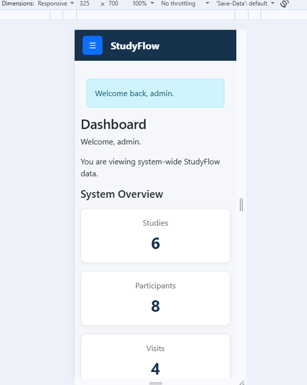
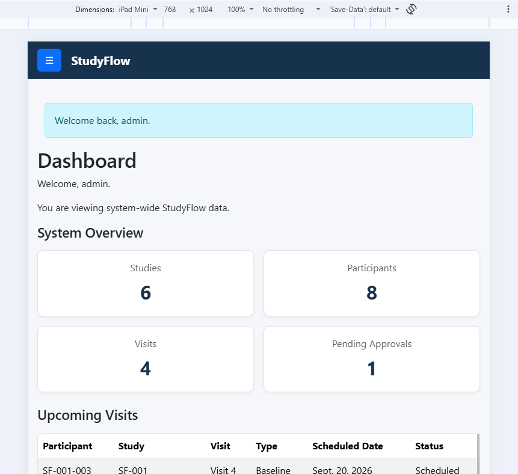
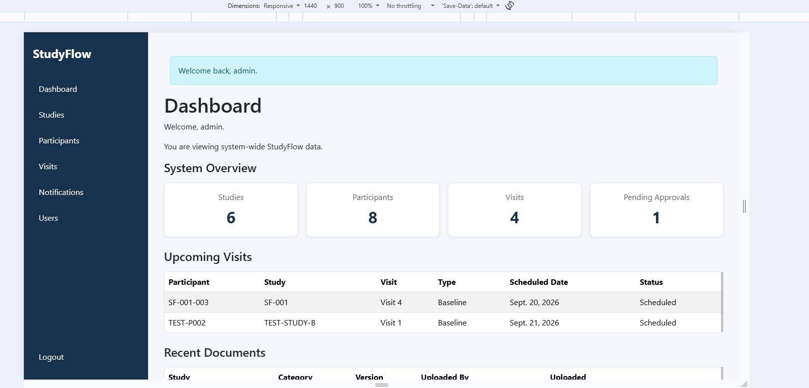
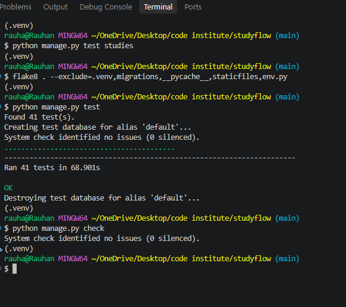
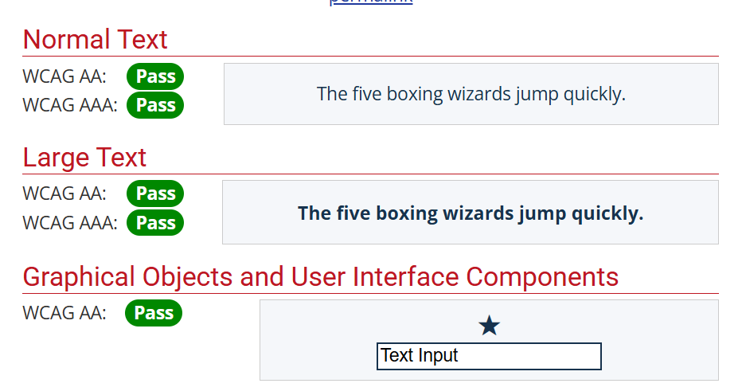

# Testing

> [!NOTE]
> Return to the [README.md](README.md) file.

StudyFlow has been tested throughout development using manual functional
testing, defensive testing, code validation, responsive testing, and
Django system checks.

Detailed user-story testing is documented separately in
[USER_STORY_TESTING.md](USER_STORY_TESTING.md).

---

## Code Validation

Code validation was carried out on the project's HTML, CSS, and Python
code. Third-party libraries such as Bootstrap were not included in the
validation of developer-authored code.

### HTML

The deployed StudyFlow application was tested using the W3C HTML
Validator.

For authenticated Django pages, the rendered page source was copied from
the deployed application using **View Page Source** and validated using
the validator's direct-input option. This ensured that the compiled HTML
was tested rather than Django template syntax.

During validation, actionable HTML and ARIA issues were corrected.

The registration page initially produced four validation errors caused by
Django form help text being rendered through `{{ form.as_p }}`. The form
was changed to render its fields individually while preserving Django's
form validation and help text.

The dashboard also initially produced five ARIA-related validation
errors. These were corrected by adding the appropriate dialog role to
the mobile offcanvas navigation and removing unnecessary `aria-label`
attributes from generic dashboard card containers.

Following these fixes, the actionable errors were removed.

A recurring generic end-of-document `Parse Error` was still reported by
the validator on the tested pages. The generated page source was
inspected and contained the expected closing Bootstrap script, `body`,
and `html` structure. As no specific malformed element was identified,
no speculative code changes were made solely to suppress this message.

| Page | Evidence | Result |
| --- | --- | --- |
| Registration |  | Actionable errors corrected; generic end-of-document parse error remained |
| Dashboard |  | Actionable ARIA errors corrected; generic parse error remained |
| Users |  | Generic parse error remained |
| Studies |  | Generic parse error remained |
| Study Detail |  | Generic parse error remained |
| Participants |  | Generic parse error remained |
| Add Participant |  | Generic parse error remained |
| Visits |  | Generic parse error remained |
| Add Visit |  | Generic parse error remained |
| Notifications |  | Generic parse error remained |
| 404 |  | Generic parse error remained |
| Log in |  | No errors |


---

### CSS

The developer-authored stylesheet at `static/css/style.css` was tested
using the W3C CSS Validator.

The validation returned **no errors**.

Bootstrap is loaded as a third-party dependency and was therefore not
included as developer-authored CSS validation.

| File | Result | Evidence |
| --- | --- | --- |
| `static/css/style.css` | No errors |  |

---

### JavaScript

A small amount of custom JavaScript is used within the StudyFlow
`create_study.html` template to improve date selection when creating
a study.

The script listens for changes to the study start date and:

- sets the minimum permitted end date to the selected start date; and
- clears an existing end date if it becomes earlier than the newly
  selected start date.

The JavaScript was validated using JSHint.

JSHint returned no errors or warnings. The reported cyclomatic
complexity for the function was **3**.

| File | Result | Evidence |
| --- | --- | --- |
| `create_study.html` JavaScript | No errors or warnings |  |

The JavaScript provides client-side usability assistance only.
Study date validation is also handled by the Django `StudyForm` on the
server side, so the application does not rely solely on JavaScript for
date validation.

---

### Python

Python code was checked locally with **Flake8** and representative
developer-authored files were additionally validated using the
**Code Institute CI Python Linter**.

The local Flake8 review identified formatting issues including:

- missing final newlines;
- blank-line spacing;
- whitespace on blank lines;
- unused imports;
- indentation;
- line length; and
- import formatting.

These issues were corrected without intentionally changing application
business logic.

Two imports that appear unused to a static analyser are required for
side effects:

- `accounts.signals` is loaded by `AccountsConfig.ready()` to register
  Django signals.
- `env` is loaded locally by `settings.py` to make local environment
  variables available.

These intentional imports use `# noqa: F401`.

After the cleanup, the project was checked with:

```bash
flake8 . --exclude=.venv,migrations,__pycache__,staticfiles,env.py --max-line-length=79
```

Django's own system check was also run:

```bash
python manage.py check
```

Result:

```text
System check identified no issues (0 silenced).
```

The following main project files have also been checked with the
CI Python Linter and returned no errors:

| Application | File | Result | Evidence |
| --- | --- | --- | --- |
| participants | `models.py` | No errors |  |
| participants | `forms.py` | No errors |  |
| participants | `views.py` | No errors |  |
| studies | `models.py` | No errors |  |
| studies | `forms.py` | No errors |  |
| studies | `views.py` | No errors |  |
| accounts | `models.py` | No errors |  |
| accounts | `forms.py` | No errors |  |
| accounts | `views.py` | No errors |  |
| dashboard | `views.py` | No errors |  |
| notifications | `models.py` | No errors |  |
| notifications | `views.py` | No errors |  |
| notifications | `utils.py` | No errors |  |
| studyflow | `settings.py` | No errors |  |

Python migration files, `__pycache__`, the virtual environment,
generated `staticfiles`, and the ignored local `env.py` secrets file
were not treated as developer-authored files requiring CI Python Linter
evidence.

---

## Lighthouse Audit

Google Chrome Lighthouse was used to audit the deployed StudyFlow
application for performance, accessibility, best practices, and SEO.

Testing was carried out using both desktop and mobile Lighthouse
configurations. The public Login page and authenticated Dashboard were
selected as representative pages.

### Lighthouse Results

| Page | Device | Performance | Accessibility | Best Practices | SEO | Evidence |
| --- | --- | ---: | ---: | ---: | ---: | --- |
| Login | Desktop | 100 | 100 | 100 | 100 |  |
| Login | Mobile | 98 | 100 | 100 | 100 |  |
| Dashboard | Desktop | 99 | 100 | 100 | 100 |  |
| Dashboard | Mobile | 97 | 100 | 100 | 100 |  |

### SEO Improvement

During the initial desktop Lighthouse audit of the Login page, the SEO
score was **90**. Lighthouse identified that the document did not have
a meta description.

A descriptive meta tag was added to the shared `base.html` template:

```html
<meta
    name="description"
    content="StudyFlow is a clinical trial site management system for managing studies, participants, visits, documents, and site activities."
>
```

After the change, `python manage.py check` reported **0 issues**. The
change was deployed and Lighthouse was run again against the deployed
application.

The Login page SEO score increased from **90 to 100**.

The final audits achieved **100 for Accessibility, Best Practices, and
SEO across all four tests**, with Performance scores ranging from
**97 to 100**.

## Browser Compatibility

StudyFlow was manually tested across multiple desktop browsers to
confirm that the deployed application renders consistently and that
core functionality remains operational.

Testing included authentication, navigation, dashboard content,
studies, participants, visits, notifications, forms, tables, buttons,
cards, and responsive navigation.

| Browser | Result | Evidence |
| --- | --- | --- |
| Google Chrome | PASS |  |
| Microsoft Edge | PASS |  |
| Mozilla Firefox | PASS |  |

No browser-specific functional or visual issues were identified during
the manual compatibility testing.

## Responsiveness

StudyFlow was manually tested across mobile, tablet, and desktop
viewports using Chrome DevTools to confirm that the interface remains
usable and responsive across different screen sizes.

Representative pages including the Dashboard, Studies, Participants,
Visits, and forms were checked at each viewport size.

Testing focused on navigation behaviour, content layout, forms, tables,
readability, horizontal overflow, and the responsive navigation system.

| Viewport | Test Size | Result | Evidence |
| --- | --- | --- | --- |
| Mobile | 325 × 700 | PASS |  |
| Tablet | 768 × 1024 | PASS |  |
| Desktop | 1440 × 900 | PASS |  |

On mobile and tablet layouts, the desktop sidebar is replaced by the
responsive hamburger/offcanvas navigation. On desktop, the full sidebar
navigation is displayed.

No significant layout issues, unwanted horizontal overflow, or unusable
interface elements were identified during responsiveness testing.

## Defensive Programming

Defensive programming techniques were implemented throughout StudyFlow
to protect application data, restrict unauthorised actions, validate
user input, and ensure users can only access functionality appropriate
to their role and study assignments.

Defensive behaviour was manually tested as part of the application's
user story testing. Detailed test cases and evidence are available in
[USER_STORY_TESTING.md](USER_STORY_TESTING.md).

### Authentication and Access Control

StudyFlow uses Django authentication together with approval, role, and
study-assignment checks to restrict access to protected functionality.

Testing included:

- unauthenticated access to protected pages
- login with incorrect credentials
- access attempts by users awaiting approval
- elevated versus standard user navigation
- restriction of user-management functionality
- restriction of study creation functionality
- standard users accessing only their assigned studies
- cross-study participant and visit access restrictions 
- notification ownership restrictions

Protected content was not exposed during the manual tests performed.

The full authentication and permission test evidence is documented in
[USER_STORY_TESTING.md](USER_STORY_TESTING.md).

### Form and Data Validation

Django forms and model constraints are used throughout StudyFlow to
reduce invalid or inconsistent data being submitted to the database.

Validation implemented within the application includes:

- required fields on study, participant, visit, and registration forms
- unique user email validation during registration
- study end dates being prevented from occurring before start dates
- participant enrolment dates being prevented from occurring before
  the participant's date of birth
- duplicate visit numbers being prevented for the same participant
- completed visits requiring an actual visit date
- actual visit dates being prevented from occurring before their
  scheduled date
- study document file extension validation
- study document file size validation
- confirmation requirements for destructive deletion actions

The Create Study form also includes a small amount of JavaScript that
improves date selection by setting the minimum end date from the
selected start date. This is a usability enhancement only; server-side
Django validation remains responsible for validating submitted study
dates.

Form validation was manually exercised during user story and defensive
testing. Invalid submissions produced validation feedback rather than
being accepted as valid application data.

Detailed test cases and supporting screenshots are available in
[USER_STORY_TESTING.md](USER_STORY_TESTING.md).

### Destructive Actions and Data Protection

StudyFlow applies additional safeguards to destructive actions to reduce
the risk of accidental or unauthorised data deletion.

For destructive deletion actions, the application requires additional
confirmation before the action is completed. Participant, visit, and
user deletion workflows require the user to:

- access the dedicated deletion confirmation page
- enter `DELETE` as an explicit confirmation
- confirm the action using their current password

Permission checks are also performed before protected actions are
allowed. Users cannot use deletion functionality to bypass the role or
study assignment restrictions applied elsewhere in the application.

User deletion includes an additional safeguard that prevents a user
from deleting their own account through the user management workflow.

Removing a user from a study is handled differently from permanent
deletion. Study assignments are deactivated rather than removed from
the database, preserving the assignment record while preventing the
user from continuing to access that study.

These behaviours were manually tested during the user story testing,
including confirmation requirements and restricted-access scenarios.

Detailed evidence is available in
[USER_STORY_TESTING.md](USER_STORY_TESTING.md).

### Defensive Testing Limitations

The manual defensive testing covered the main authentication,
authorisation, validation, ownership, and destructive-action behaviours
of StudyFlow. However, several specific scenarios were not fully
verified during browser-based testing.

The following limitations were recorded:

- **Duplicate study assignment:** the user interface prevented creation
  of a duplicate active study assignment, so direct server-side
  enforcement of a duplicate assignment was not manually tested.

- **Study document retrieval:** during initial testing, document upload
  and persistence were verified, but PDF content could not be viewed
  through the Cloudinary browser viewer. Investigation identified that
  PDF delivery was disabled within the Cloudinary security settings.
  After enabling PDF delivery, the uploaded PDF opened successfully and
  its content could be viewed.

- **Notification ownership:** attempting to access another user's
  notification through the browser did not expose the notification.
  However, a direct state-changing POST request against another user's
  notification was not manually performed.

- **Visit notification delivery:** visit-related notification logic was
  exercised, but a positive delivery scenario was not demonstrated in
  one test because the user performing the action was excluded from
  receiving their own notification and no second eligible study user
  was available.

These items were therefore not recorded as application failures.
Instead, they are documented as limitations of the manual testing
performed.

Where appropriate, server-side behaviours that cannot be safely or
reliably demonstrated through normal browser interaction can be covered
by Django automated tests.

## Automated Testing

Automated testing was implemented using Django's built-in `TestCase`
framework to test the core functionality, validation rules, permissions,
security controls and role-based behaviour of StudyFlow.

AI was used throughout the automated testing process to assist with
identifying appropriate test scenarios, generating Django test code,
explaining assertions, reviewing test coverage and troubleshooting issues
identified while the tests were being executed.

The application's existing source code was provided to AI before tests
were generated. This included the relevant models, forms, views and URL
configuration for each Django application. This approach allowed the
generated tests to be based on the actual StudyFlow implementation rather
than hypothetical functionality.

AI-generated test code was not assumed to be correct automatically. Each
test was reviewed against the existing application logic and then executed
using Django's test runner. Where a test or code-quality check identified
an issue, the result was investigated before changes were made.

The automated tests were developed incrementally across the following
applications:

| Test Area | Number of Tests | Result |
| --- | ---: | --- |
| Accounts and Permissions | 12 | PASS |
| Studies and Documents | 10 | PASS |
| Participants and Visits | 11 | PASS |
| Notifications | 6 | PASS |
| Dashboard | 2 | PASS |
| **Total** | **41** | **PASS** |

---

### AI-Assisted Testing Workflow

The following workflow was used when creating the automated tests:

1. The relevant StudyFlow models, forms, views and URL configuration were
   supplied to AI.
2. AI was asked to analyse the existing business rules and identify
   suitable automated test scenarios.
3. AI generated Django `TestCase` code based on the supplied application
   code.
4. The generated tests were reviewed to ensure that they used the correct
   models, URL names, form fields, role permissions and expected
   behaviour.
5. Tests were executed using Django's test runner.
6. Any failures were investigated rather than changing production code
   simply to make a test pass.
7. Flake8 and Django system checks were used alongside the test suite to
   identify code-quality and configuration issues.
8. Tests were committed incrementally after the relevant test group
   passed.

This process allowed AI to support test development while retaining human
review of the generated code and test results.

---

### Accounts and Permissions Testing

The Accounts test suite contains 12 automated tests.

The existing account models, registration form, profile creation logic,
login behaviour, role configuration and user-management views were
provided to AI.

An example prompt used to generate the Accounts tests was:

> Review my StudyFlow Django accounts implementation and generate
> beginner-friendly Django TestCase tests for registration validation,
> automatic UserProfile creation, account approval, login restrictions,
> user-management permissions and elevated-role assignment. Use my
> existing models, views and URL names rather than inventing new
> functionality.

AI generated tests covering:

- valid user registration;
- duplicate email rejection;
- password mismatch rejection;
- automatic `UserProfile` creation;
- new users being unapproved by default;
- prevention of login for an unapproved user;
- successful login for an approved user with a role;
- prevention of login where an approved user has no role;
- prevention of standard users accessing user management;
- access to user management for an authorised manager;
- prevention of a non-superuser manager assigning an elevated role;
- elevated-role assignment by a correctly configured Django superuser.

The Accounts tests were executed using:

    python manage.py test accounts

All 12 Accounts tests passed.

#### AI-Assisted Accounts Test Debugging

During Accounts testing, an initially failing superuser permission test
provided an example of why AI-generated tests still required review.

A Django superuser created during the test automatically received a
`UserProfile` through the application's signal. However, that profile did
not automatically contain the approved StudyFlow Admin role configuration
required by the application's additional permission layer.

The failure was reviewed against the actual application logic. The test
setup was then corrected so that the test superuser had the appropriate
approved Admin profile and role.

Production permission logic was not changed simply to make the test pass.

This demonstrated that AI-generated tests were executed, interpreted and
adjusted to accurately represent the application's real permission
structure.

---

### Studies and Documents Testing

The Studies test suite contains 10 automated tests.

The `Study` and `StudyDocument` models, forms, permission functions, views
and URL configuration were provided to AI before the tests were
generated.

An example prompt used was:

> Review my Study, StudyDocument, StudyForm, StudyDocumentForm and study
> permission views. Generate Django TestCase tests covering date
> validation, study creation permissions, assigned-study visibility,
> elevated-user visibility, study-detail access, document extension
> validation and the 10 MB upload limit. Base every test on the code I
> provide and do not invent URL names or business rules.

AI-assisted tests were created for:

- rejection of a study end date occurring before its start date;
- acceptance of valid study dates;
- prevention of a standard user accessing study creation;
- access to study creation for an authorised manager;
- assigned-study visibility for a standard user;
- exclusion of inactive study assignments;
- visibility of all studies for an elevated user;
- prevention of access to an unassigned study's detail page;
- rejection of unsupported study-document file extensions;
- rejection of study documents larger than the 10 MB limit.

The Studies tests were executed using:

    python manage.py test studies

All 10 Studies tests passed.

---

### Participants and Visits Testing

The Participants and Visits test suite contains 11 automated tests.

The `Participant` and `Visit` models, `ParticipantForm`, `VisitForm`,
participant and visit views, permission logic and URL configuration were
provided to AI.

An example prompt used was:

> Using my existing Participant and Visit models, forms, views and URLs,
> generate Django TestCase tests for participant enrolment-date
> validation, participant-number normalisation, valid participant data,
> duplicate visit prevention, visit date validation, completed-visit
> requirements, valid visits and cross-study update/delete permission
> protection. Include POST-based tests for destructive actions so that
> direct URL requests cannot bypass study permissions.

AI-assisted tests were created for areas including:

- rejection of an enrolled date occurring before the participant's date
  of birth;
- acceptance of valid participant data;
- conversion of participant numbers to uppercase;
- rejection of duplicate visit numbers for the same participant;
- rejection of an actual visit date occurring before the scheduled date;
- requirement for an actual date when a visit is marked as completed;
- acceptance of valid visit data;
- prevention of updating a participant belonging to an unassigned study;
- prevention of deleting a participant belonging to an unassigned study;
- prevention of updating a visit belonging to an unassigned study;
- prevention of deleting a visit belonging to an unassigned study.

The destructive permission tests used POST requests where appropriate.
This was important because it tested the state-changing operation rather
than only confirming that an unauthorised user could not view the
corresponding form.

The Participants and Visits tests were executed using:

    python manage.py test participants

All 11 Participants and Visits tests passed.

---

### Notification Testing

The Notifications test suite contains 6 automated tests.

The `Notification` model, notification views, URL configuration and
notification utility functions were supplied to AI.

An example prompt used was:

> Review my Notification model, notification views, URLs and notification
> utility functions. Generate Django tests for notification ownership,
> listing only the logged-in user's notifications, marking notifications
> as read, preventing one user from modifying another user's
> notifications, mark-all isolation and notifying only eligible users
> assigned to a study.

Tests were created to verify:

- a user can see their own notification;
- a user cannot see another user's notification;
- a user can mark their own notification as read;
- a user cannot mark another user's notification as read;
- the mark-all operation only modifies the logged-in user's
  notifications;
- study notifications are only generated for eligible assigned users and
  can exclude the user responsible for triggering the notification.

These tests provide automated evidence that notification data is isolated
between users.

The notification ownership test was particularly important because it
tested a state-changing POST request that had not been fully demonstrated
during earlier manual defensive testing.

---

### GitHub Copilot Unit Test Generation

GitHub Copilot was also used directly within VS Code to generate a Django
unit test.

This was used to demonstrate AI-generated automated testing within the
development environment.

The prompt supplied to GitHub Copilot was:

> Create a Django TestCase method for my existing
> NotificationViewTests class that verifies the logged-in user cannot
> mark another user's notification as read. Use the existing
> self.other_notification created in setUp. POST to the existing
> notifications:mark_notification_read URL. After the request, refresh
> the notification from the database and assert that is_read remains
> False. The view uses get_object_or_404 filtered by request.user.
> Do not modify application code.

The generated test attempted to access another user's notification through
the existing `mark_notification_read` view.

The application's view restricts the notification lookup using both the
notification ID and the currently authenticated user:

    notification = get_object_or_404(
        Notification,
        id=notification_id,
        user=request.user,
    )

The test then refreshed the other user's notification from the database
and confirmed that its `is_read` state remained `False`.

This demonstrated that a user could not bypass notification ownership
controls by manually submitting a POST request containing another
notification's ID.

The Copilot-generated code was reviewed against the existing notification
view before being included in the test suite.

The Notifications tests were executed using:

    python manage.py test notifications

All 6 Notifications tests passed.

---

### Dashboard Testing

The Dashboard test suite contains 2 automated tests.

The existing `dashboard_home` view was provided to AI so that tests could
be based on the actual role-based dashboard queries.

An example prompt used was:

> Review my dashboard_home Django view and generate tests proving that a
> standard user's dashboard statistics and upcoming visits are limited to
> actively assigned studies, while an elevated user's dashboard uses
> global study, participant and visit data. Use the actual context
> variables returned by my view.

The resulting tests verify two important dashboard behaviours.

#### Standard User Dashboard

Test data was created across multiple studies while the standard user was
assigned to only one study.

The test confirmed that the standard dashboard only counted studies,
participants and visits associated with the user's active study
assignments.

It also confirmed that upcoming visits were restricted to the user's
assigned study data.

#### Elevated User Dashboard

The elevated-user test confirmed that an authorised elevated role receives
global statistics rather than statistics restricted through
`UserStudy` assignments.

The Dashboard tests were executed using:

    python manage.py test dashboard

Both Dashboard tests passed.

---

### Reviewing and Debugging AI-Generated Tests

AI-generated code was treated as development assistance rather than being
assumed to be correct.

Tests were executed incrementally and their behaviour was compared with
the application's existing business rules.

Two examples of this review process were:

#### Superuser Permission Test

An Accounts test initially failed because a test-created Django superuser
still had to satisfy StudyFlow's own profile, approval and role permission
structure.

The test setup was corrected to accurately represent a configured
StudyFlow administrator rather than weakening the application's permission
checks.

#### Flake8 Unused Variable

A project-wide Flake8 check identified:

    studies/tests.py:141:9: F841 local variable 'unassigned_study'
    is assigned to but never used

The test required the unassigned study to exist in the database but did
not require a Python variable referencing it.

The unnecessary variable assignment was therefore removed while retaining
creation of the study required by the test scenario.

Flake8 was rerun after the correction and returned no remaining output.

These examples demonstrate that AI-generated test code was reviewed and
refined rather than being copied into the project without validation.

---

### Running the Automated Tests

Tests were first executed separately while each application test suite was
being developed:

    python manage.py test accounts
    python manage.py test studies
    python manage.py test participants
    python manage.py test notifications
    python manage.py test dashboard

Running tests independently made it easier to identify which application
was responsible for a failure before running the complete project test
suite.

After all individual test groups passed, the complete automated suite was
executed from the project root:

    python manage.py test

The final terminal output was:

    Found 41 test(s).
    Creating test database for alias 'default'...
    System check identified no issues (0 silenced).
    .........................................
    ----------------------------------------------------------------------
    Ran 41 tests in 68.901s

    OK
    Destroying test database for alias 'default'...

All **41 automated tests passed successfully**.

The passing test suite covers core application functionality including
form validation, authentication, permissions, role-based data isolation,
study access, participant and visit rules, destructive-operation
protection, notification ownership and dashboard data scoping.

---

### Automated Test Evidence

The following screenshot shows the terminal output from the complete
StudyFlow test suite, including all 41 tests passing successfully.



---

### Django System Check

Following the successful automated test suite, Django's built-in system
check was executed:

    python manage.py check

The result was:

    System check identified no issues (0 silenced).

This confirmed that Django did not identify configuration or application
issues through its system-check framework.

---

### Python Code Quality Check

A final project-wide Flake8 check was performed using:

    flake8 . --exclude=.venv,migrations,__pycache__,staticfiles,env.py

The command excludes generated, environment-specific and dependency files
that are not part of the manually authored application code.

An unused local variable was initially identified in
`studies/tests.py`. After the test was reviewed and the unnecessary
assignment removed, Flake8 was rerun successfully with no remaining
output.

---

### Automated Testing Result

The completed automated testing process resulted in:

| Check | Result |
| --- | --- |
| Accounts automated tests | 12 PASS |
| Studies automated tests | 10 PASS |
| Participants and Visits automated tests | 11 PASS |
| Notifications automated tests | 6 PASS |
| Dashboard automated tests | 2 PASS |
| **Complete Django test suite** | **41/41 PASS** |
| Django system check | PASS - 0 issues |
| Project-wide Flake8 check | PASS |

The final automated test suite therefore completed with **41 out of 41
tests passing** and no issues reported by Django's system check.

### Colour Contrast Testing
WebAIM used for contrast testing [https://webaim.org/resources/contrastchecker/](https://webaim.org/resources/contrastchecker/)

Colour contrast was tested using the WebAIM Contrast Checker to ensure that
the StudyFlow colour palette provides sufficient contrast between foreground
text and background colours.

The main colour combinations used throughout the application were checked
against WCAG contrast requirements. This included navigation text, body text,
primary interface colours, form content and other important text/background
combinations.

The testing helped verify that colour choices remained readable and accessible.
StudyFlow also avoids relying on colour alone to communicate important
information, with text labels and status descriptions used alongside colour
where appropriate.

