# StudyFlow - User Story Testing

This document records the manual browser testing completed for the StudyFlow capstone. Evidence is presented **inside the relevant test table**, so the assessor can compare the test, expected behaviour, observed result and screenshot in one place.

## Phase 1 - Authentication
| Test ID | User Story | Test / Action | Expected Result | Actual Result | Result | Evidence |
| --- | --- | --- | --- | --- | --- | --- |
| P1-01 | US03 | Perform the recorded browser test for this feature and verify the visible behaviour, access control or validation. | The application should behave according to the relevant StudyFlow user story and role/validation rules. | Unapproved login rejected; password not visible and fields cleared. | **PASS** |  P1-E01 |
| P1-02 | US03, US05 | Perform the recorded browser test for this feature and verify the visible behaviour, access control or validation. | The application should behave according to the relevant StudyFlow user story and role/validation rules. | Authenticated elevated interface with Users navigation. | **PASS** |  P1-E02 |
| P1-03 | US03, US05 | Perform the recorded browser test for this feature and verify the visible behaviour, access control or validation. | The application should behave according to the relevant StudyFlow user story and role/validation rules. | Authenticated elevated interface with Users navigation. | **PASS** |  P1-E02 |
| P1-04 | See phase test record | Perform the manual browser test recorded for this test ID. | The observed behaviour should match the relevant StudyFlow user-story acceptance criteria. | Manual browser test recorded in the phase report; no dedicated screenshot file was saved. | **PASS** | <em>No dedicated screenshot saved</em> |
| P1-05 | US03, US04, US05 | Perform the recorded browser test for this feature and verify the visible behaviour, access control or validation. | The application should behave according to the relevant StudyFlow user story and role/validation rules. | Login/access-control screen after logout and protected-page revisit; redirect URL verified by browser observation. | **PASS** |  P1-E04 |
| P1-06 | US03, US05 | Perform the recorded browser test for this feature and verify the visible behaviour, access control or validation. | The application should behave according to the relevant StudyFlow user story and role/validation rules. | Authenticated standard interface and assignment-scoped wording; Users absent. | **PASS** |  P1-E03 |
| P1-07 | US03, US05 | Perform the recorded browser test for this feature and verify the visible behaviour, access control or validation. | The application should behave according to the relevant StudyFlow user story and role/validation rules. | Authenticated standard interface and assignment-scoped wording; Users absent. | **PASS** |  P1-E03 |
| P1-08 | US03, US05 | Perform the recorded browser test for this feature and verify the visible behaviour, access control or validation. | The application should behave according to the relevant StudyFlow user story and role/validation rules. | Authenticated standard interface and assignment-scoped wording; Users absent. | **PASS** |  P1-E03 |
| P1-09 | US03, US04, US05 | Perform the recorded browser test for this feature and verify the visible behaviour, access control or validation. | The application should behave according to the relevant StudyFlow user story and role/validation rules. | Login/access-control screen after logout and protected-page revisit; redirect URL verified by browser observation. | **PASS** |  P1-E04 |
| P1-10 | See phase test record | Perform the manual browser test recorded for this test ID. | The observed behaviour should match the relevant StudyFlow user-story acceptance criteria. | Manual browser test recorded in the phase report; no dedicated screenshot file was saved. | **PASS** | <em>No dedicated screenshot saved</em> |

## Phase 2 - User Management & Permissions
| Test ID | User Story | Test / Action | Expected Result | Actual Result | Result | Evidence |
| --- | --- | --- | --- | --- | --- | --- |
| P2-01 | US01 | Perform the recorded browser test for this feature and verify the visible behaviour, access control or validation. | The application should behave according to the relevant StudyFlow user story and role/validation rules. | Registration success and approval next step. | **PASS** | 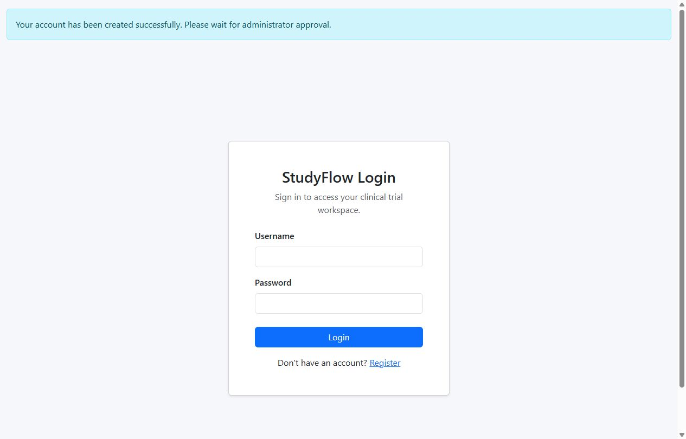 P2-E01 |
| P2-02 | US01 | Perform the recorded browser test for this feature and verify the visible behaviour, access control or validation. | The application should behave according to the relevant StudyFlow user story and role/validation rules. | Duplicate email validation. | **PASS** | 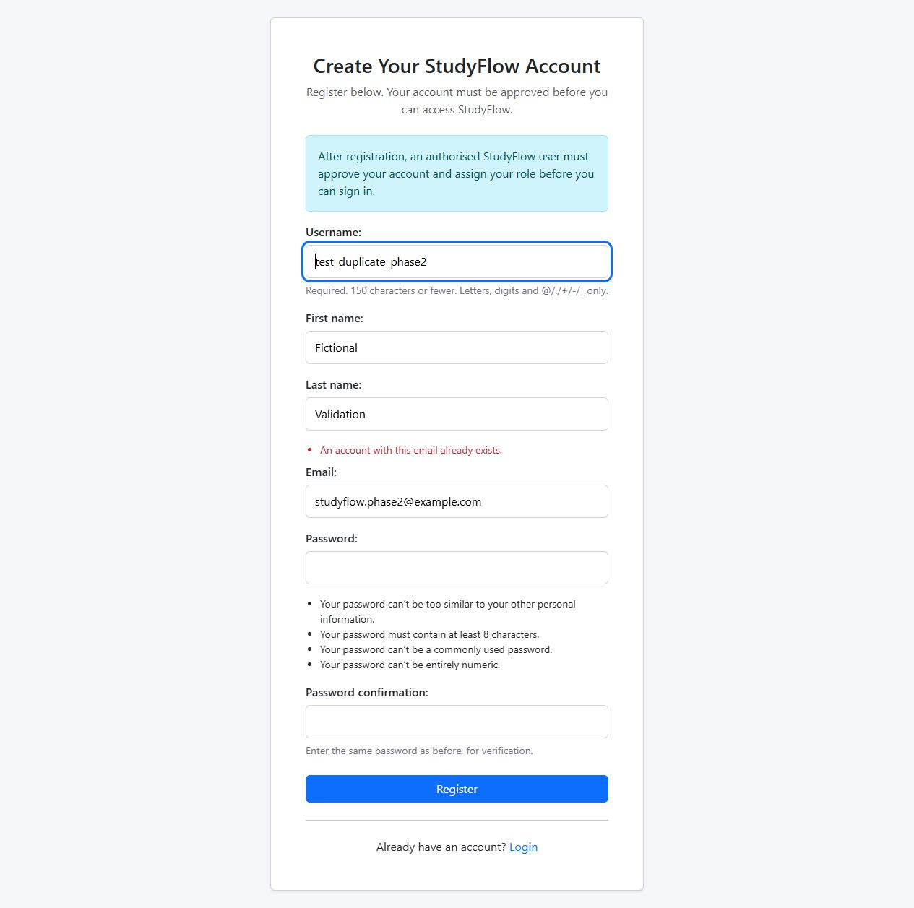 P2-E02 |
| P2-03 | US01 | Perform the recorded browser test for this feature and verify the visible behaviour, access control or validation. | The application should behave according to the relevant StudyFlow user story and role/validation rules. | Password mismatch validation. | **PASS** | 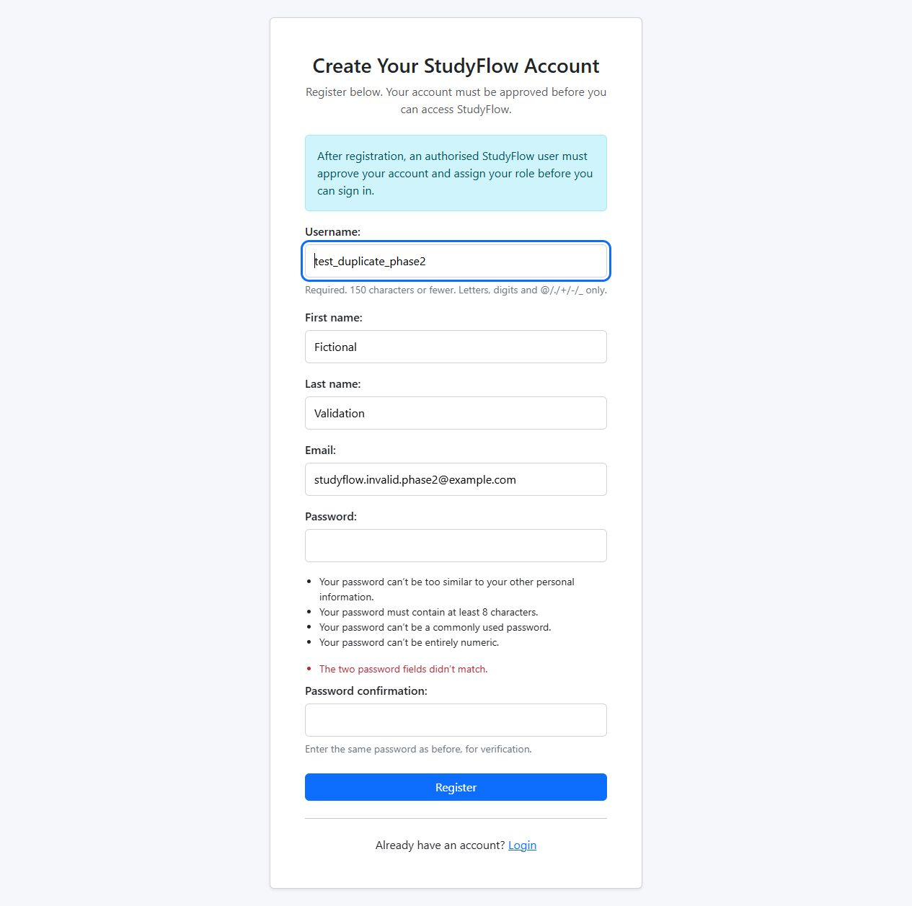 P2-E10 |
| P2-04 | US02, US06, US07, US08 | Perform the recorded browser test for this feature and verify the visible behaviour, access control or validation. | The application should behave according to the relevant StudyFlow user story and role/validation rules. | Both pending test accounts and review controls. | **PASS** | 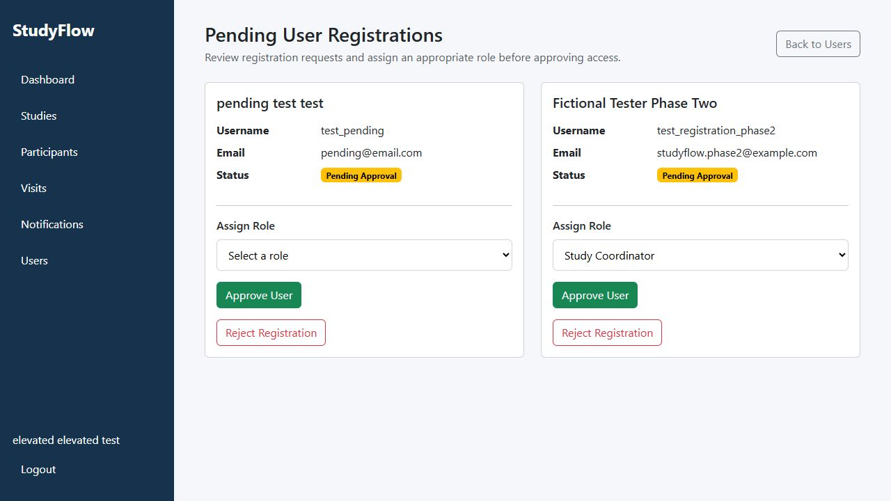 P2-E03 |
| P2-05 | US02, US06, US07 | Perform the recorded browser test for this feature and verify the visible behaviour, access control or validation. | The application should behave according to the relevant StudyFlow user story and role/validation rules. | Approved disposable account with one Study A assignment; Approval success; disposable account removed from pending list. | **PASS** | 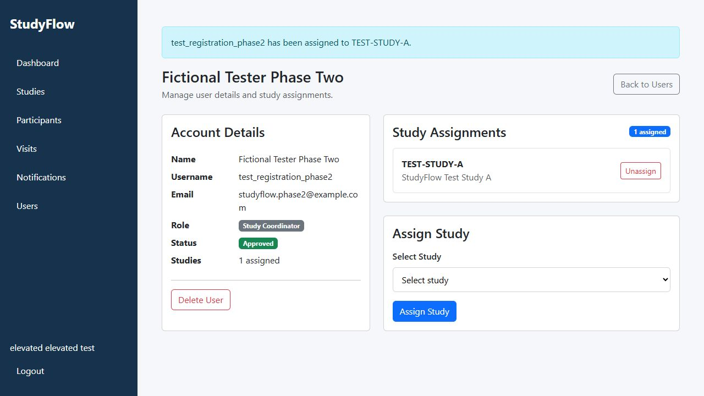 P2-E06  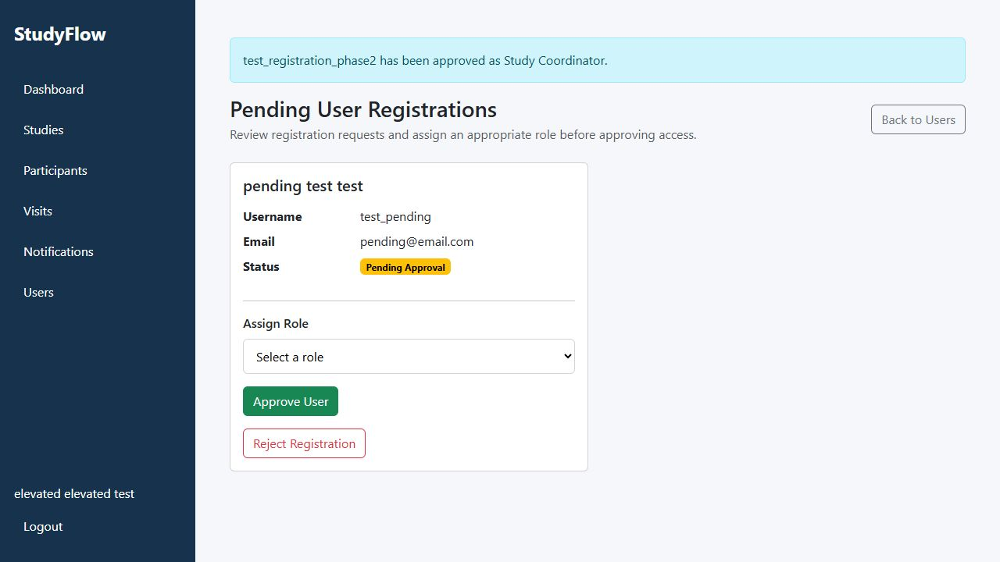 P2-E11 |
| P2-06 | US02 | Perform the recorded browser test for this feature and verify the visible behaviour, access control or validation. | The application should behave according to the relevant StudyFlow user story and role/validation rules. | Rejection/removal success and empty pending list. | **PASS** | 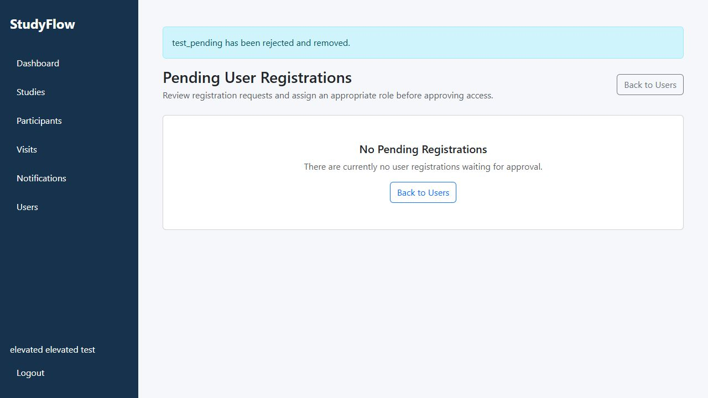 P2-E12 |
| P2-07 | US06, US02, US07 | Perform the recorded browser test for this feature and verify the visible behaviour, access control or validation. | The application should behave according to the relevant StudyFlow user story and role/validation rules. | User information and filtered coordinator search; Approved disposable account with one Study A assignment. | **PASS** | 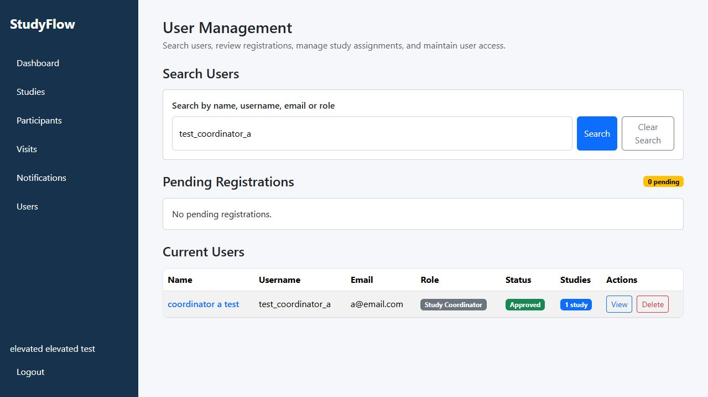 P2-E04   P2-E06 |
| P2-08 | US06 | Perform the recorded browser test for this feature and verify the visible behaviour, access control or validation. | The application should behave according to the relevant StudyFlow user story and role/validation rules. | User information and filtered coordinator search. | **PASS** |  P2-E04 |
| P2-09 | US02, US06, US07, US08 | Perform the recorded browser test for this feature and verify the visible behaviour, access control or validation. | The application should behave according to the relevant StudyFlow user story and role/validation rules. | Both pending test accounts and review controls; Standard role and denial of direct Users access. | **PASS** |  P2-E03   P2-E05 |
| P2-10 | US06, US07, US08 | Perform the recorded browser test for this feature and verify the visible behaviour, access control or validation. | The application should behave according to the relevant StudyFlow user story and role/validation rules. | Standard role and denial of direct Users access. | **PASS** |  P2-E05 |
| P2-11 | US06, US07, US08 | Perform the recorded browser test for this feature and verify the visible behaviour, access control or validation. | The application should behave according to the relevant StudyFlow user story and role/validation rules. | Individual-user access denied with dashboard redirect. | **PASS** | 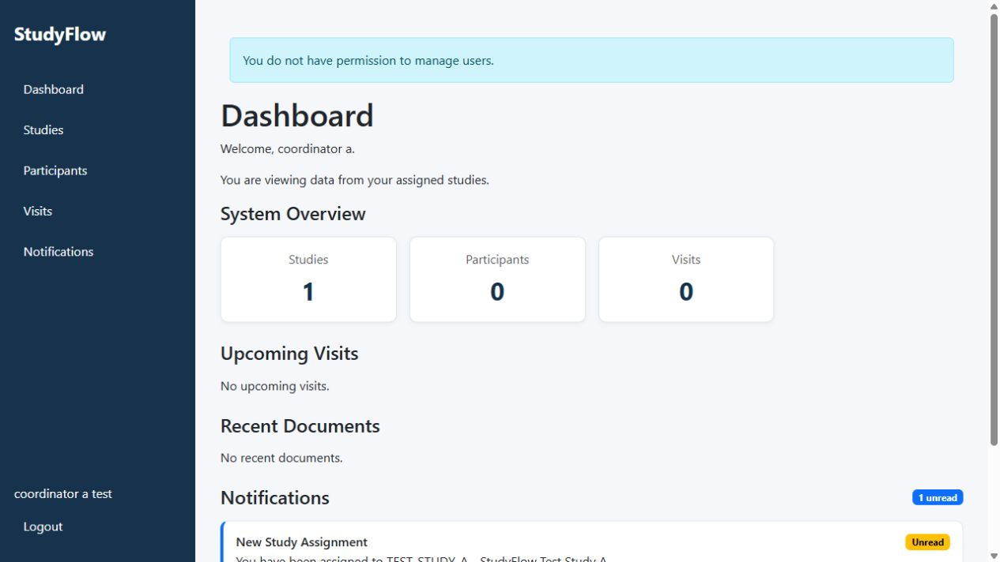 P2-E13 |
| P2-12 | US02, US06, US07 | Perform the recorded browser test for this feature and verify the visible behaviour, access control or validation. | The application should behave according to the relevant StudyFlow user story and role/validation rules. | Approved disposable account with one Study A assignment. | **PASS** |  P2-E06 |
| P2-13 | US02, US06, US07 | Attempt a duplicate active Study A assignment through the normal user-assignment interface. | A duplicate active user-study assignment should not be created. | Study A was already assigned and was excluded from the available choices, so a duplicate submission could not be performed without request manipulation. | **NOT TESTED / PARTIAL** |  P2-E06 |
| P2-14 | US07 | Perform the recorded browser test for this feature and verify the visible behaviour, access control or validation. | The application should behave according to the relevant StudyFlow user story and role/validation rules. | Unassignment success and zero active assignments. | **PASS** | 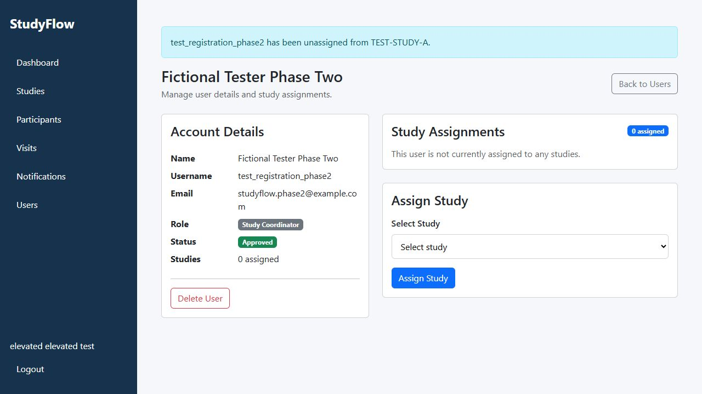 P2-E14 |
| P2-15 | US08 | Perform the recorded browser test for this feature and verify the visible behaviour, access control or validation. | The application should behave according to the relevant StudyFlow user story and role/validation rules. | Incorrect confirmation rejected. | **PASS** | 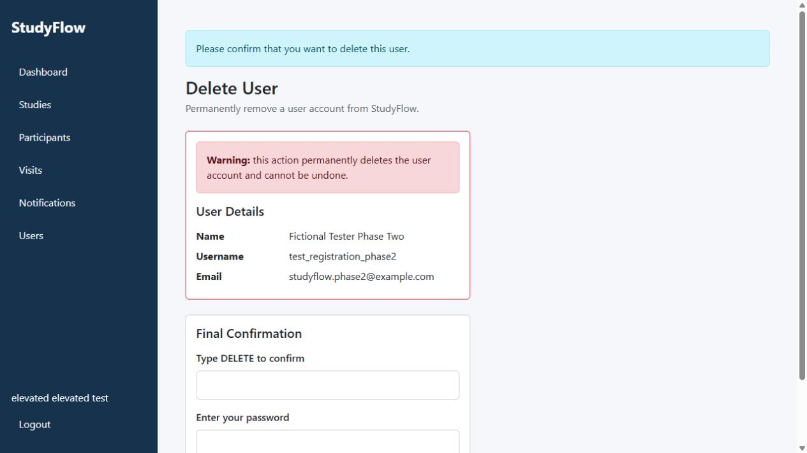 P2-E07 |
| P2-16 | US08 | Perform the recorded browser test for this feature and verify the visible behaviour, access control or validation. | The application should behave according to the relevant StudyFlow user story and role/validation rules. | Successful disposable-user deletion message; Deleted disposable username absent from search. | **PASS** | 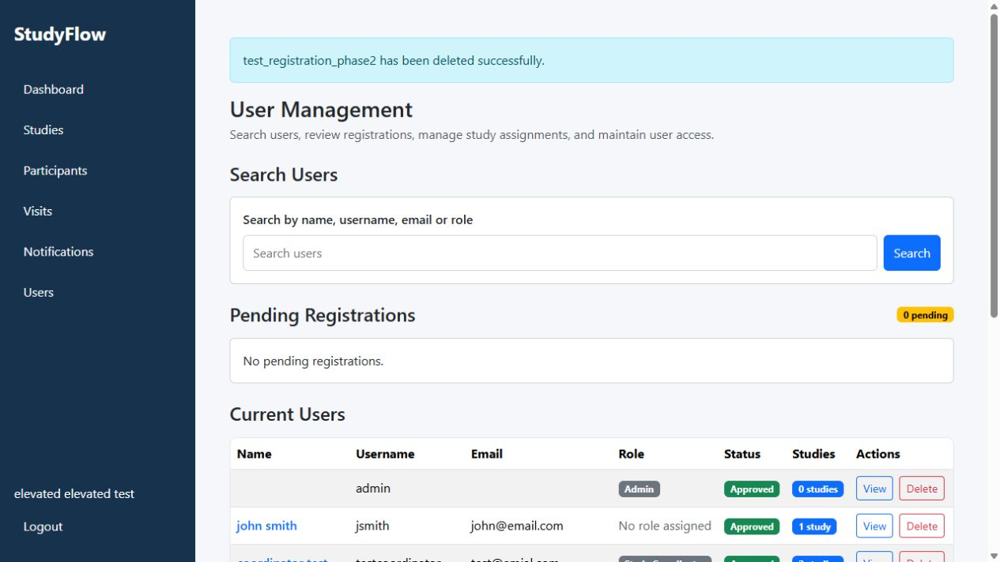 P2-E08  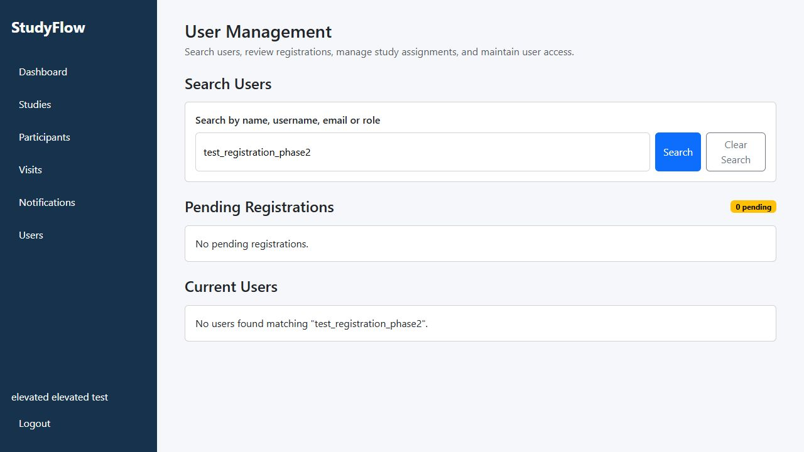 P2-E15 |
| P2-17 | US02 | Perform the recorded browser test for this feature and verify the visible behaviour, access control or validation. | The application should behave according to the relevant StudyFlow user story and role/validation rules. | Investigator’s approval role-control context; dropdown capture limitation above. | **PASS** | 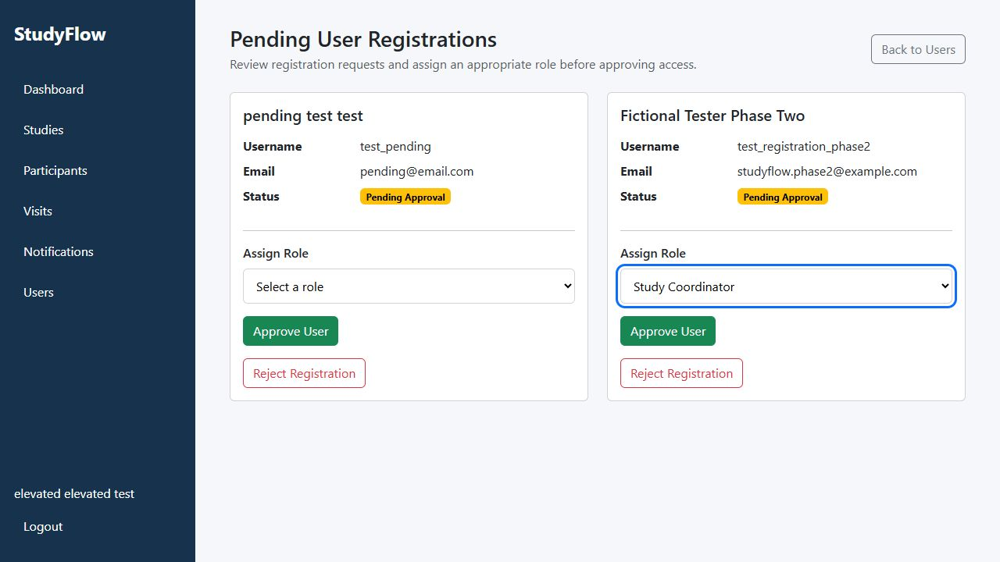 P2-E09 |

## Phase 3 — Studies & Documents
| Test ID | User Story | Test / Action | Expected Result | Actual Result | Result | Evidence |
| --- | --- | --- | --- | --- | --- | --- |
| P3-01 | US09 | Perform the recorded browser test for this feature and verify the visible behaviour, access control or validation. | The application should behave according to the relevant StudyFlow user story and role/validation rules. | Invalid date submission blocked with browser feedback; Study creation success message. | **PASS** | 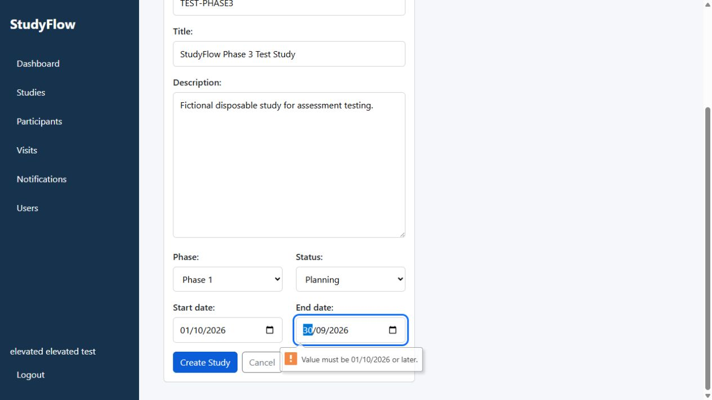 P3-E01  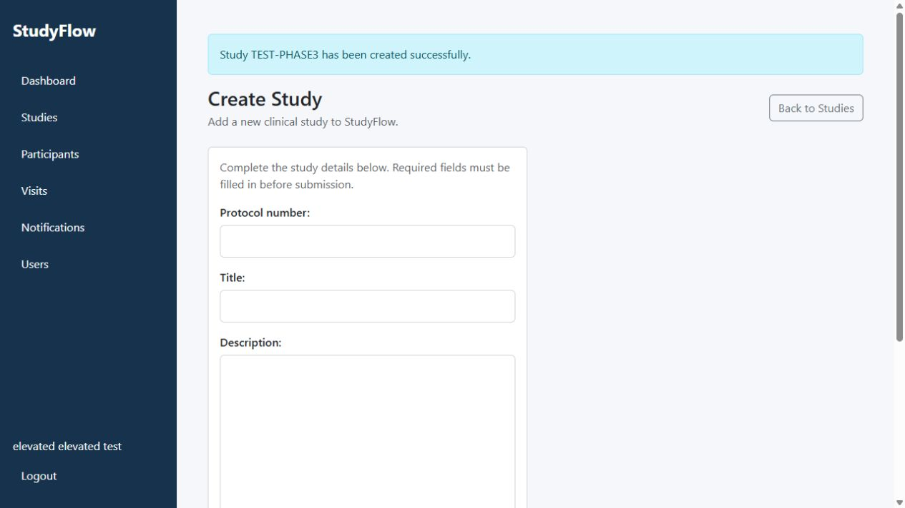 P3-E02 |
| P3-02 | US09 | Perform the recorded browser test for this feature and verify the visible behaviour, access control or validation. | The application should behave according to the relevant StudyFlow user story and role/validation rules. | Invalid date submission blocked with browser feedback. | **PASS** |  P3-E01 |
| P3-03 | US09, US10 | Perform the recorded browser test for this feature and verify the visible behaviour, access control or validation. | The application should behave according to the relevant StudyFlow user story and role/validation rules. | Study creation success message; Elevated list includes A, B and TEST-PHASE3. | **PASS** |  P3-E02  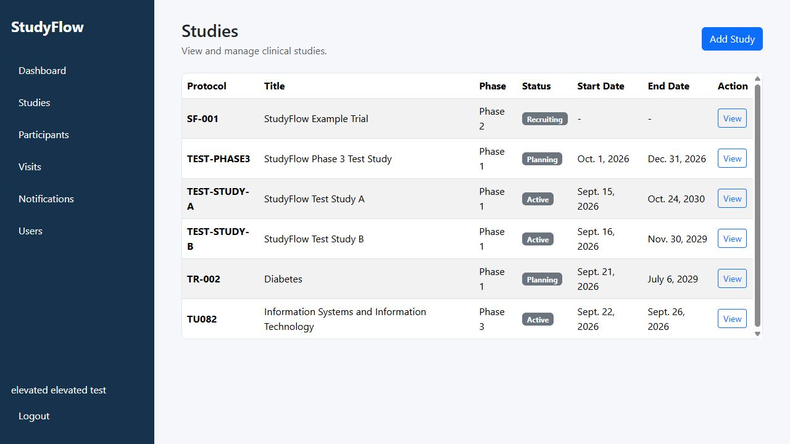 P3-E03 |
| P3-04 | US09, US10 | Perform the recorded browser test for this feature and verify the visible behaviour, access control or validation. | The application should behave according to the relevant StudyFlow user story and role/validation rules. | Elevated list includes A, B and TEST-PHASE3. | **PASS** |  P3-E03 |
| P3-05 | See phase test record | Perform the manual browser test recorded for this test ID. | The observed behaviour should match the relevant StudyFlow user-story acceptance criteria. | Manual browser test recorded in the phase report; no dedicated screenshot file was saved. | **PASS** | <em>No dedicated screenshot saved</em> |
| P3-06 | US11, US09 | Perform the recorded browser test for this feature and verify the visible behaviour, access control or validation. | The application should behave according to the relevant StudyFlow user story and role/validation rules. | Coordinator A sees only A; Add Study absent. | **PASS** | 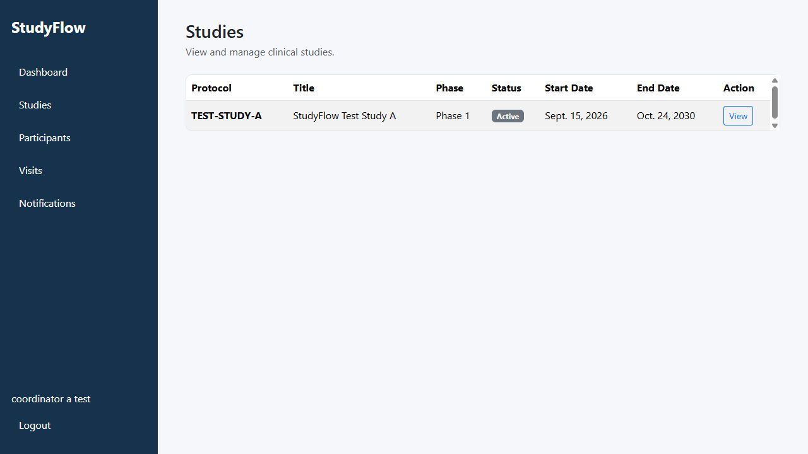 P3-E04 |
| P3-07 | See phase test record | Perform the manual browser test recorded for this test ID. | The observed behaviour should match the relevant StudyFlow user-story acceptance criteria. | Manual browser test recorded in the phase report; no dedicated screenshot file was saved. | **PASS** | <em>No dedicated screenshot saved</em> |
| P3-08 | US11, US12 | Perform the recorded browser test for this feature and verify the visible behaviour, access control or validation. | The application should behave according to the relevant StudyFlow user story and role/validation rules. | Coordinator A denied Study B detail/upload interface. | **PASS** |  P3-E05 |
| P3-09 | US11, US12 | Perform the recorded browser test for this feature and verify the visible behaviour, access control or validation. | The application should behave according to the relevant StudyFlow user story and role/validation rules. | Coordinator A denied Study B detail/upload interface. | **PASS** |  P3-E05 |
| P3-10 | US11, US09 | Perform the recorded browser test for this feature and verify the visible behaviour, access control or validation. | The application should behave according to the relevant StudyFlow user story and role/validation rules. | Coordinator A sees only A; Add Study absent. | **PASS** |  P3-E04 |
| P3-11 | US09 | Perform the recorded browser test for this feature and verify the visible behaviour, access control or validation. | The application should behave according to the relevant StudyFlow user story and role/validation rules. | Standard user denied study creation. | **PASS** | 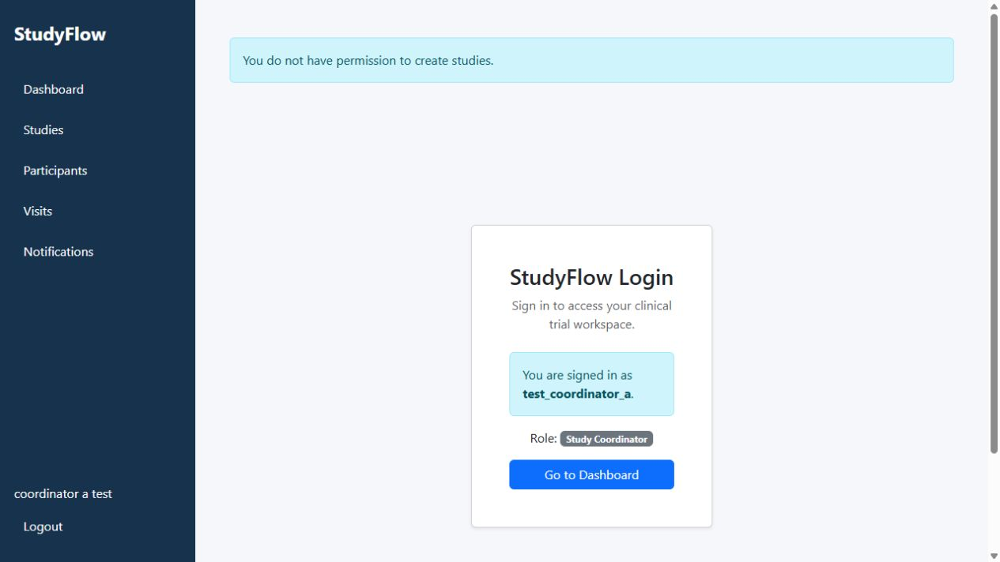 P3-E06 |
| P3-12 | See phase test record | Perform the manual browser test recorded for this test ID. | The observed behaviour should match the relevant StudyFlow user-story acceptance criteria. | Manual browser test recorded in the phase report; no dedicated screenshot file was saved. | **PASS** | <em>No dedicated screenshot saved</em> |
| P3-13 | US12 | Perform the recorded browser test for this feature and verify the visible behaviour, access control or validation. | The application should behave according to the relevant StudyFlow user story and role/validation rules. | Application rejects unsupported document type. | **PASS** | 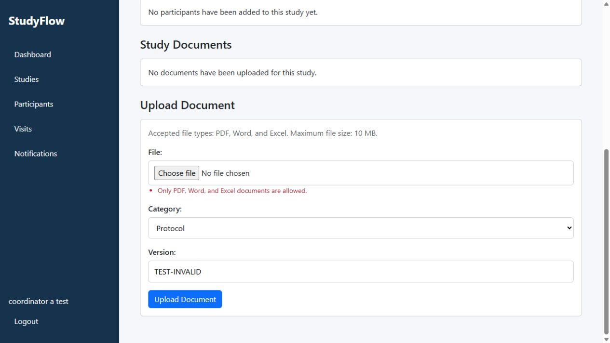 P3-E07 |
| P3-14 | US12 | Perform the recorded browser test for this feature and verify the visible behaviour, access control or validation. | The application should behave according to the relevant StudyFlow user story and role/validation rules. | Uploaded PDF listed with correct metadata. | **PASS** | 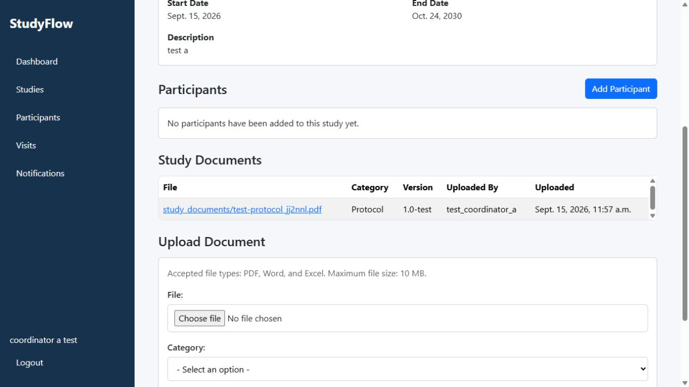 P3-E08 |
| P3-15 | US12 | Re-open the uploaded Study A protocol document and verify that the uploaded file remains available and readable. | The uploaded document should persist and its file content should be accessible. | The document listing persisted after reload, but the linked Cloudinary destination opened a blank viewer, so readable file content was not verified. | **NOT TESTED / PARTIAL** |  P3-E08   P3-E11 |
| P3-16 | US11, US12 | Perform the recorded browser test for this feature and verify the visible behaviour, access control or validation. | The application should behave according to the relevant StudyFlow user story and role/validation rules. | Coordinator A denied Study B detail/upload interface. | **PASS** |  P3-E05 |
| P3-17 | US11 | Perform the recorded browser test for this feature and verify the visible behaviour, access control or validation. | The application should behave according to the relevant StudyFlow user story and role/validation rules. | Coordinator B sees only B. | **PASS** |  P3-E09 |
| P3-18 | US11 | Perform the recorded browser test for this feature and verify the visible behaviour, access control or validation. | The application should behave according to the relevant StudyFlow user story and role/validation rules. | Coordinator B denied Study A. | **PASS** | 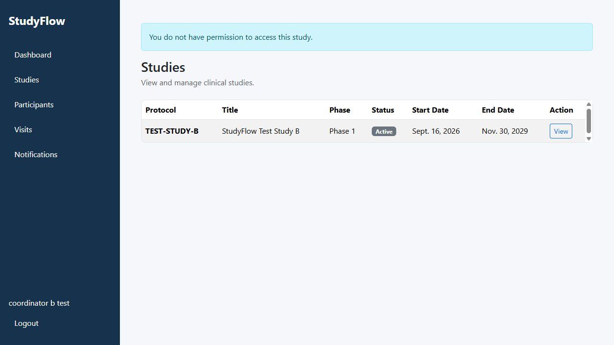 P3-E10 |

## Phase 4 — Participants
| Test ID | User Story | Test / Action | Expected Result | Actual Result | Result | Evidence |
| --- | --- | --- | --- | --- | --- | --- |
| P4-01 | US13 | Perform the recorded browser test for this feature and verify the visible behaviour, access control or validation. | The application should behave according to the relevant StudyFlow user story and role/validation rules. | Required-field browser validation. | **PASS** | 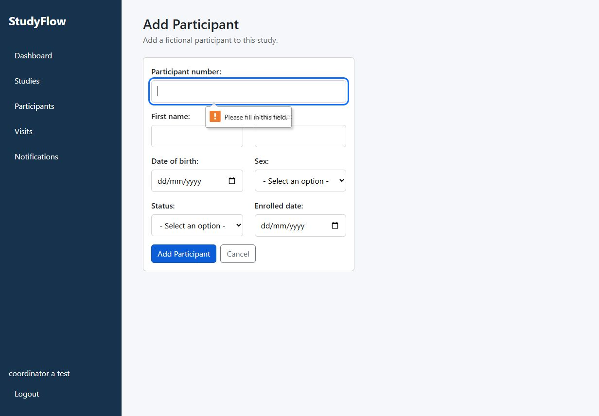 P4-E01 |
| P4-02 | US13 | Perform the recorded browser test for this feature and verify the visible behaviour, access control or validation. | The application should behave according to the relevant StudyFlow user story and role/validation rules. | Required-field browser validation. | **PASS** |  P4-E01 |
| P4-03 | US13 | Perform the recorded browser test for this feature and verify the visible behaviour, access control or validation. | The application should behave according to the relevant StudyFlow user story and role/validation rules. | Invalid enrolment date rejected. | **PASS** | 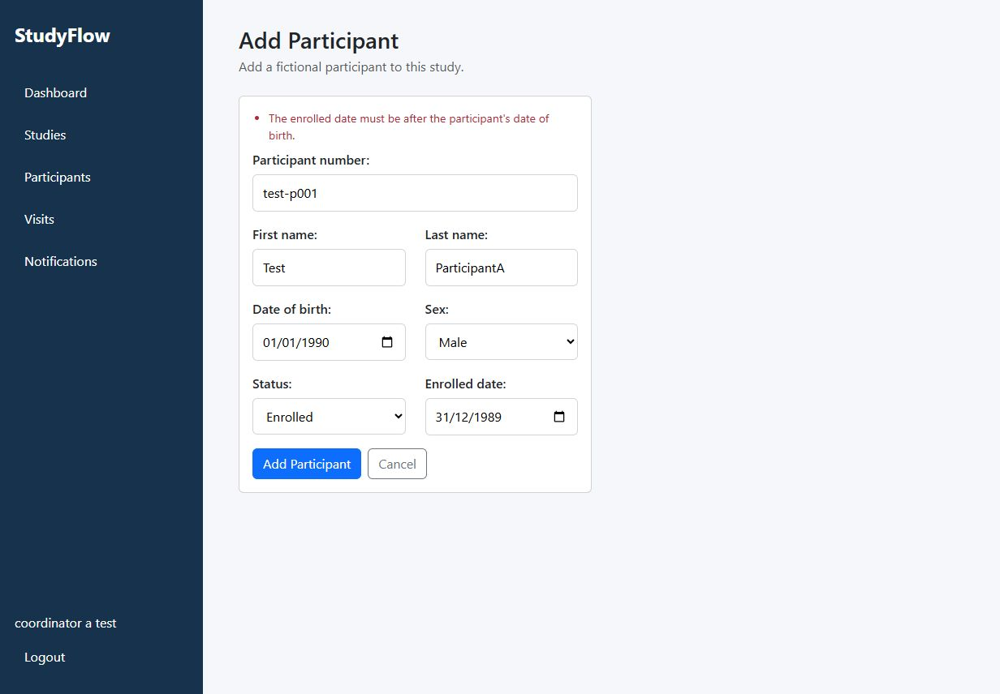 P4-E02 |
| P4-04 | US13 | Perform the recorded browser test for this feature and verify the visible behaviour, access control or validation. | The application should behave according to the relevant StudyFlow user story and role/validation rules. | Creation success, uppercase identifier and Study A association. | **PASS** |  P4-E03 |
| P4-05 | US14 | Perform the recorded browser test for this feature and verify the visible behaviour, access control or validation. | The application should behave according to the relevant StudyFlow user story and role/validation rules. | Coordinator A participant listing. | **PASS** | 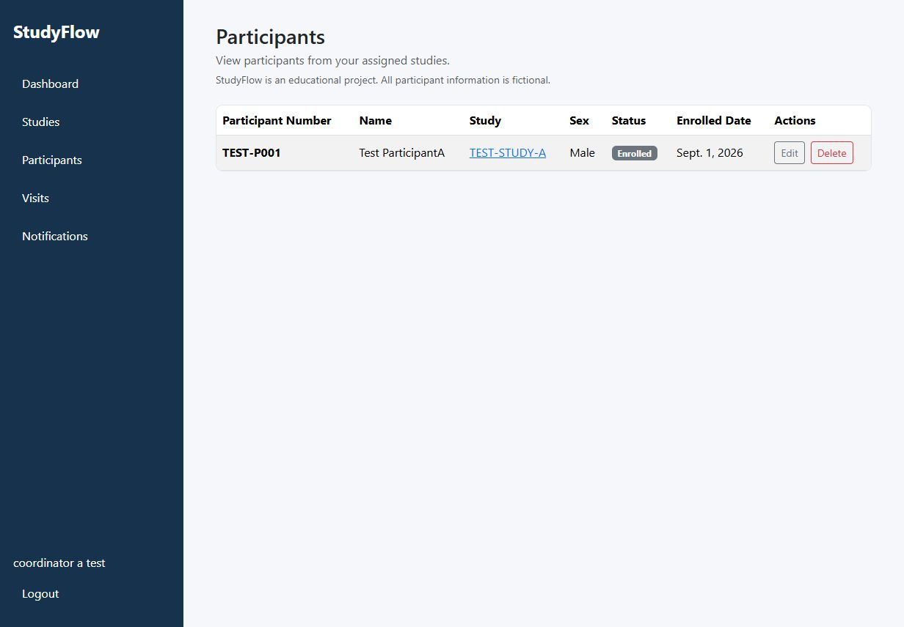 P4-E04 |
| P4-06 | US14 | Perform the recorded browser test for this feature and verify the visible behaviour, access control or validation. | The application should behave according to the relevant StudyFlow user story and role/validation rules. | Coordinator A participant listing. | **PASS** |  P4-E04 |
| P4-07 | US13 | Perform the recorded browser test for this feature and verify the visible behaviour, access control or validation. | The application should behave according to the relevant StudyFlow user story and role/validation rules. | Duplicate identifier rejected. | **PASS** | 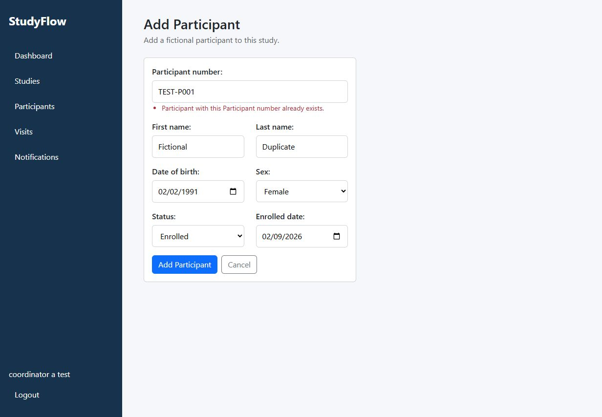 P4-E05 |
| P4-08 | US15 | Perform the recorded browser test for this feature and verify the visible behaviour, access control or validation. | The application should behave according to the relevant StudyFlow user story and role/validation rules. | Successful update to Active. | **PASS** | 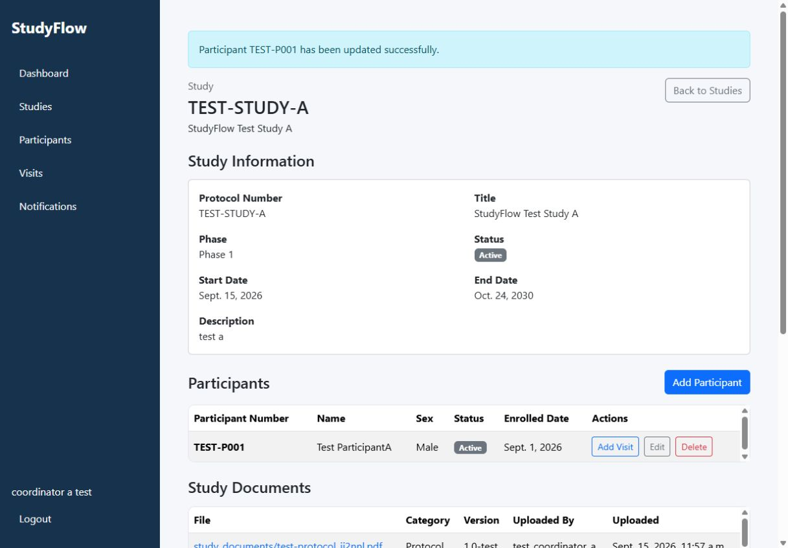 P4-E06 |
| P4-09 | US15 | Perform the recorded browser test for this feature and verify the visible behaviour, access control or validation. | The application should behave according to the relevant StudyFlow user story and role/validation rules. | Invalid update validation. | **PASS** | 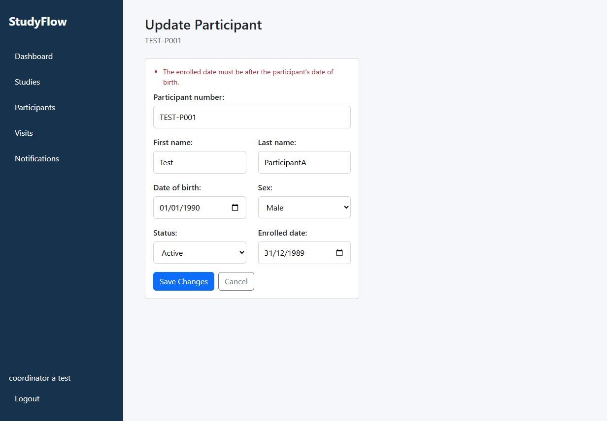 P4-E12 |
| P4-10 | US14 | Perform the recorded browser test for this feature and verify the visible behaviour, access control or validation. | The application should behave according to the relevant StudyFlow user story and role/validation rules. | B’s empty list while P001 exists in A. | **PASS** | 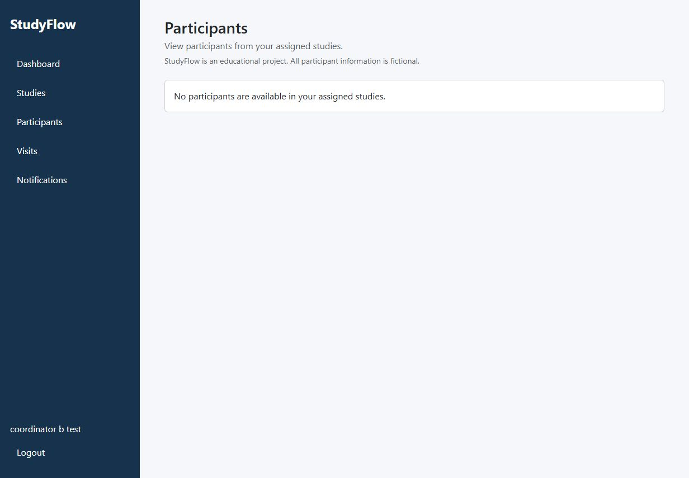 P4-E13 |
| P4-11 | US15 | Perform the recorded browser test for this feature and verify the visible behaviour, access control or validation. | The application should behave according to the relevant StudyFlow user story and role/validation rules. | Coordinator B denied TEST-P001 update access. | **PASS** | 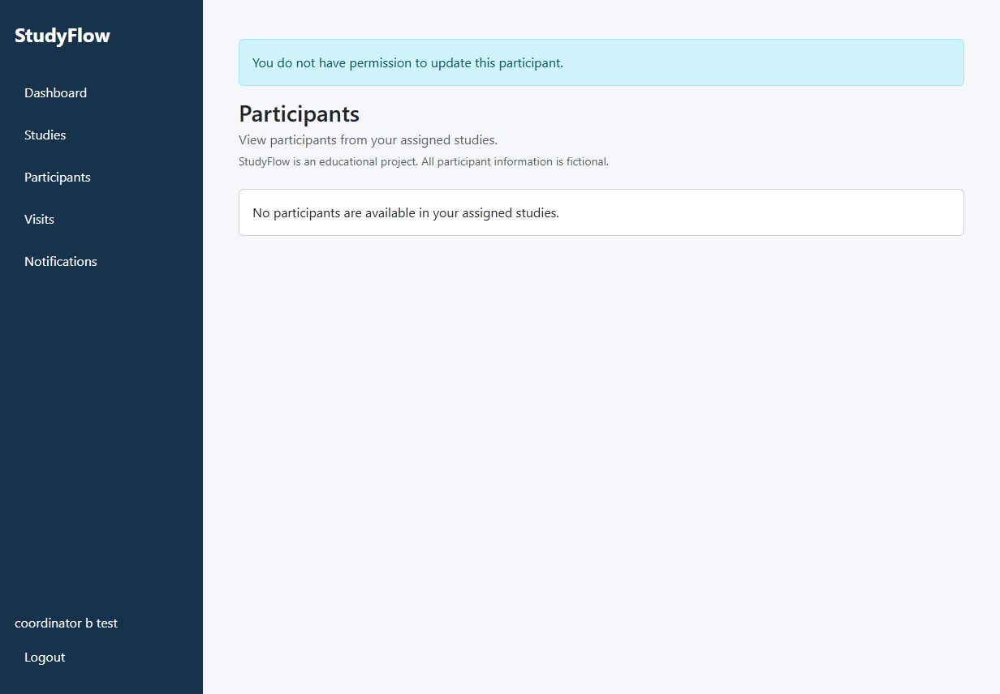 P4-E07 |
| P4-12 | US13 | Perform the recorded browser test for this feature and verify the visible behaviour, access control or validation. | The application should behave according to the relevant StudyFlow user story and role/validation rules. | B denied Study A participant creation. | **PASS** | 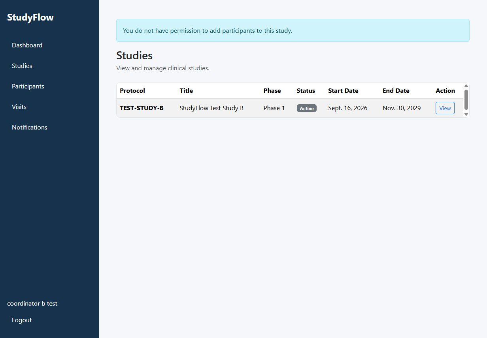 P4-E14 |
| P4-13 | US13 | Perform the recorded browser test for this feature and verify the visible behaviour, access control or validation. | The application should behave according to the relevant StudyFlow user story and role/validation rules. | TEST-P002 created in Study B. | **PASS** | 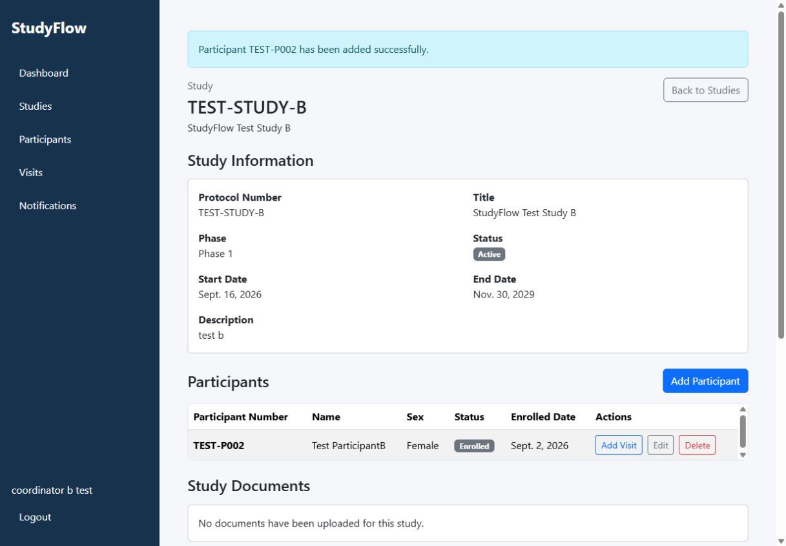 P4-E08 |
| P4-14 | US14 | Perform the recorded browser test for this feature and verify the visible behaviour, access control or validation. | The application should behave according to the relevant StudyFlow user story and role/validation rules. | B sees P002 while P001 is absent. | **PASS** |  P4-E15 |
| P4-15 | US14 | Perform the recorded browser test for this feature and verify the visible behaviour, access control or validation. | The application should behave according to the relevant StudyFlow user story and role/validation rules. | A sees P001 while P002 is absent. | **PASS** | 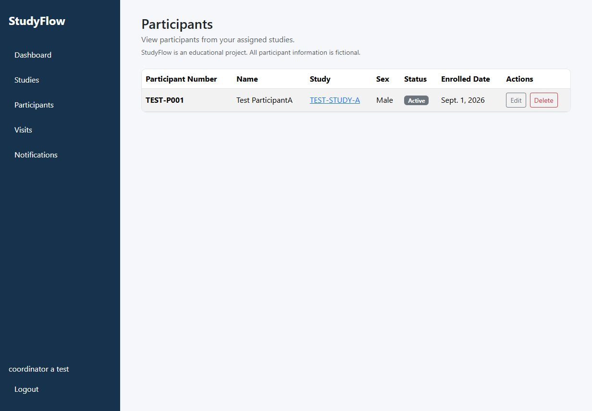 P4-E09 |
| P4-16 | US16 | Perform the recorded browser test for this feature and verify the visible behaviour, access control or validation. | The application should behave according to the relevant StudyFlow user story and role/validation rules. | Incorrect deletion confirmation rejected. | **PASS** | 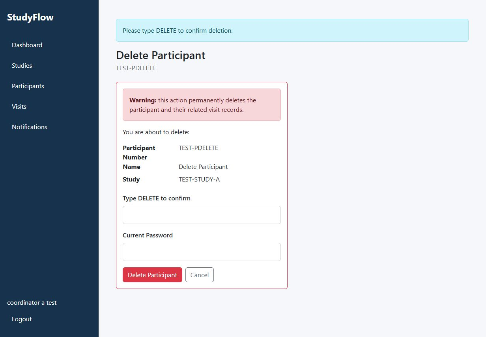 P4-E10 |
| P4-17 | US16 | Perform the recorded browser test for this feature and verify the visible behaviour, access control or validation. | The application should behave according to the relevant StudyFlow user story and role/validation rules. | Deletion success; P001 retained. | **PASS** |  P4-E11 |
