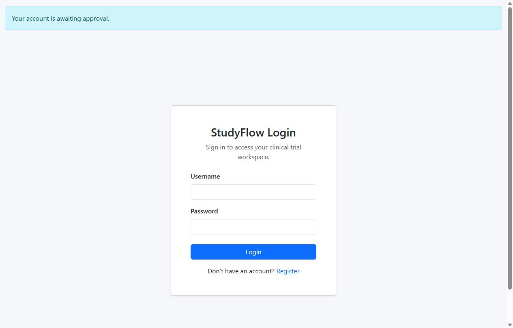
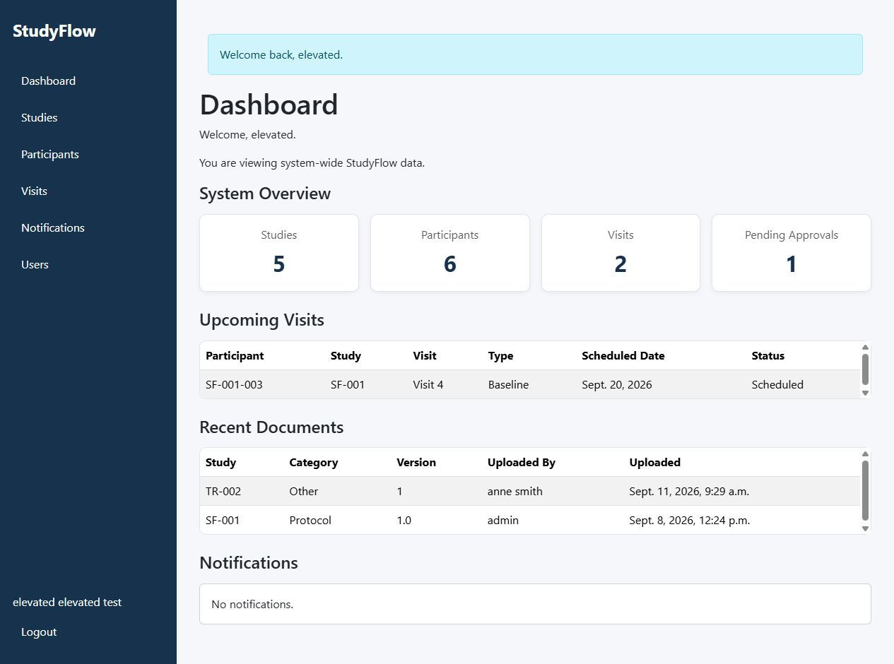
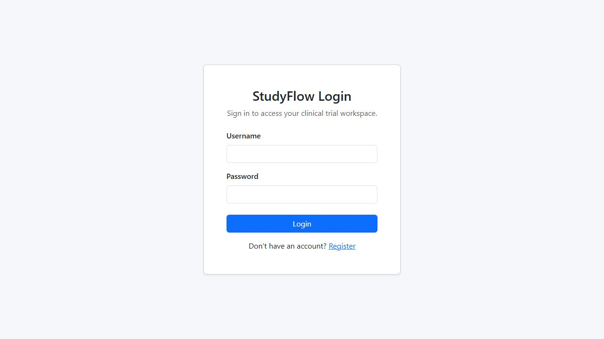
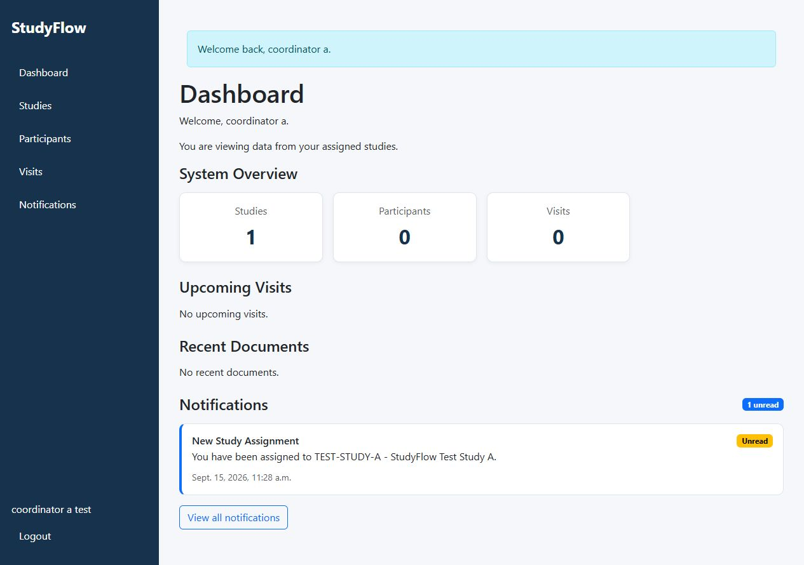

# StudyFlow — User Story Testing

This document records the manual browser testing completed for the StudyFlow capstone. Evidence is presented **inside the relevant test table**, so the assessor can compare the test, expected behaviour, observed result and screenshot in one place.

## Phase 1 — Authentication
| Test ID | User Story | Test / Action | Expected Result | Actual Result | Result | Evidence |
| --- | --- | --- | --- | --- | --- | --- |
| P1-01 | US03 | Perform the recorded browser test for this feature and verify the visible behaviour, access control or validation. | The application should behave according to the relevant StudyFlow user story and role/validation rules. | Unapproved login rejected; password not visible and fields cleared. | **PASS** |  P1-E01 |
| P1-02 | US03, US05 | Perform the recorded browser test for this feature and verify the visible behaviour, access control or validation. | The application should behave according to the relevant StudyFlow user story and role/validation rules. | Authenticated elevated interface with Users navigation. | **PASS** |  P1-E02 |
| P1-03 | US03, US05 | Perform the recorded browser test for this feature and verify the visible behaviour, access control or validation. | The application should behave according to the relevant StudyFlow user story and role/validation rules. | Authenticated elevated interface with Users navigation. | **PASS** |  P1-E02 |
| P1-04 | See phase test record | Perform the manual browser test recorded for this test ID. | The observed behaviour should match the relevant StudyFlow user-story acceptance criteria. | Manual browser test recorded in the phase report; no dedicated screenshot file was saved. | **PASS** | <em>No dedicated screenshot saved</em> |
| P1-05 | US03, US04, US05 | Perform the recorded browser test for this feature and verify the visible behaviour, access control or validation. | The application should behave according to the relevant StudyFlow user story and role/validation rules. | Login/access-control screen after logout and protected-page revisit; redirect URL verified by browser observation. | **PASS** |  P1-E04 |
| P1-06 | US03, US05 | Perform the recorded browser test for this feature and verify the visible behaviour, access control or validation. | The application should behave according to the relevant StudyFlow user story and role/validation rules. | Authenticated standard interface and assignment-scoped wording; Users absent. | **PASS** |  P1-E03 |
| P1-07 | US03, US05 | Perform the recorded browser test for this feature and verify the visible behaviour, access control or validation. | The application should behave according to the relevant StudyFlow user story and role/validation rules. | Authenticated standard interface and assignment-scoped wording; Users absent. | **PASS** |  P1-E03 |
| P1-08 | US03, US05 | Perform the recorded browser test for this feature and verify the visible behaviour, access control or validation. | The application should behave according to the relevant StudyFlow user story and role/validation rules. | Authenticated standard interface and assignment-scoped wording; Users absent. | **PASS** |  P1-E03 |
| P1-09 | US03, US04, US05 | Perform the recorded browser test for this feature and verify the visible behaviour, access control or validation. | The application should behave according to the relevant StudyFlow user story and role/validation rules. | Login/access-control screen after logout and protected-page revisit; redirect URL verified by browser observation. | **PASS** |  P1-E04 |
| P1-10 | See phase test record | Perform the manual browser test recorded for this test ID. | The observed behaviour should match the relevant StudyFlow user-story acceptance criteria. | Manual browser test recorded in the phase report; no dedicated screenshot file was saved. | **PASS** | <em>No dedicated screenshot saved</em> |

